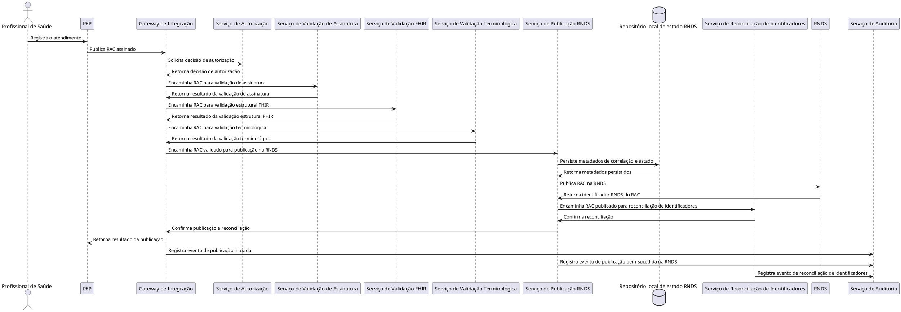

# Publicação de RAC — arquiteturas candidatas e decisão

## 1. Objetivo e cenário orientador

Este documento evolui o diagrama de contexto consolidado para o primeiro diagrama de contêineres C4, por meio de uma fatia vertical executável: a publicação de um RAC sintético produzido por um PEP na RNDS simulada.

Cenário: um PEP simulado publica um RAC sintético. A plataforma autentica e autoriza a solicitação, valida o documento e sua assinatura, garante idempotência, publica-o na RNDS simulada, reconcilia os identificadores e registra a operação para auditoria.

O PEP e a RNDS simulada permanecem como sistemas externos em todas as alternativas — nenhuma delas propõe implementá-los ou trazê-los para dentro da fronteira da Plataforma de Interoperabilidade em Saúde.

## 2. Responsabilidades identificadas

Antes de atribuir a contêineres, as responsabilidades do cenário foram listadas isoladamente:

1. Autenticação do PEP
2. Autorização da solicitação
3. Validação de assinatura do RAC
4. Validação estrutural FHIR do RAC
5. Validação terminológica do RAC
6. Garantia de idempotência da publicação
7. Publicação do RAC na RNDS simulada
8. Reconciliação entre identificador local e identificador RNDS
9. Registro de auditoria da operação

Essas nove responsabilidades são o ponto de partida de ambas as arquiteturas candidatas — a diferença entre elas está em como são agrupadas em unidades executáveis, não em quais responsabilidades existem.

## 3. Requisitos arquiteturalmente significativos (ASRs) considerados

- ASR-1 Idempotência: repetição de uma submissão pelo PEP não pode gerar duplicidade na RNDS nem inconsistência de estado local.
- ASR-2 Resiliência à indisponibilidade externa: a indisponibilidade da RNDS não pode corromper o estado interno nem travar indefinidamente o PEP.
- ASR-3 Consistência entre publicação e correlação: uma falha entre publicar na RNDS e persistir a correlação local não pode deixar a plataforma sem saber que o documento já foi aceito pela RNDS.
- ASR-4 Auditabilidade: toda decisão e operação, bem-sucedida ou não, deve ser rastreável a um evento de auditoria.
- ASR-5 Modularidade e evolutividade: a fatia deve poder evoluir para outros tipos de documento (ex.: IPS) e outras jornadas sem redesenho completo.
- ASR-6 Escalabilidade: volume potencialmente alto de publicações concorrentes, herdado do requisito de escala da plataforma nacional como um todo.

## 4. Arquitetura Candidata 1 — menor número de contêineres, maior modularidade interna

```plantuml
@startuml Publicacao_RAC_Alternativa_1
!include https://raw.githubusercontent.com/plantuml-stdlib/C4-PlantUML/master/C4_Container.puml

LAYOUT_WITH_LEGEND()

title Diagrama de Contêineres (C4) - Publicação de RAC (Alternativa 1)

Person(profissional, "Profissional de Saúde", "Registra o atendimento no PEP")

System_Ext(pep, "PEP", "Prontuário Eletrônico do Paciente que produz o RAC")
System_Ext(rnds, "RNDS", "Repositório nacional de dados em saúde")

System_Boundary(plataforma, "Plataforma Nacional de Interoperabilidade em Saúde") {
    Container(gateway, "Gateway de Integração", "API Gateway", "Autentica PEP, aplica políticas e encaminha requisições ao serviço responsável")
    Container(servicoDocumentoRnds, "Serviço de Documento RNDS", "Orquestrador RNDS", "Valida RAC, garante idempotência, publica na RNDS e reconcilia identificadores", "Inclui módulos internos para validação de assinatura, validação FHIR estrutural e terminológica")
    ContainerDb(dbDocumentoRnds, "Repositório local de estado RNDS", "Banco de dados", "Persiste metadados de correlação, idempotência e estado de integração com a RNDS (sem armazenar os documentos em si)")
    Container(auditoria, "Serviço de Auditoria", "Auditoria", "Registra eventos de publicação e reconciliação")
}

Rel(profissional, pep, "Registra o atendimento")
Rel(pep, gateway, "Publica RAC assinado", "HTTPS / FHIR")

Rel(gateway, servicoDocumentoRnds, "Encaminha RAC já autenticado e autorizado", "FHIR")
Rel(servicoDocumentoRnds, rnds, "Publica RAC validado", "Web Service RNDS")
Rel(rnds, servicoDocumentoRnds, "Retorna identificador RNDS do documento")

Rel(servicoDocumentoRnds, dbDocumentoRnds, "Persiste metadados de correlação e estado", "JDBC/SQL")
Rel(dbDocumentoRnds, servicoDocumentoRnds, "Retorna metadados persistidos")

Rel(gateway, auditoria, "Registra evento de publicação iniciada")
Rel(servicoDocumentoRnds, auditoria, "Registra evento de publicação concluída e reconciliação de identificadores")

SHOW_LEGEND()

@enduml
```

Racional de agrupamento: as responsabilidades de validação (assinatura, FHIR estrutural, terminológica), idempotência, publicação e reconciliação são coesas o suficiente — todas giram em torno do mesmo documento e do mesmo ciclo de vida de publicação — para viver dentro de um único serviço, com separação apenas em nível de módulo interno. O Gateway concentra autenticação e autorização como ponto único de entrada; o banco de estado e a auditoria ficam separados porque têm natureza de persistência e retenção diferentes do processamento.

Essa alternativa prioriza simplicidade operacional (menos peças para implantar, monitorar e versionar) em troca de menor capacidade de escalar ou evoluir cada responsabilidade de forma independente.

## 5. Arquitetura Candidata 2 — serviços mais especializados

```plantuml
@startuml Publicacao_RAC_Alternativa_2
!include https://raw.githubusercontent.com/plantuml-stdlib/C4-PlantUML/master/C4_Container.puml

LAYOUT_WITH_LEGEND()

title Diagrama de Contêineres (C4) - Publicação de RAC (Alternativa 2)

Person(profissional, "Profissional de Saúde", "Registra o atendimento no PEP")

System_Ext(pep, "PEP", "Prontuário Eletrônico do Paciente que produz o RAC")
System_Ext(rnds, "RNDS", "Repositório nacional de dados em saúde")

System_Boundary(plataforma, "Plataforma Nacional de Interoperabilidade em Saúde") {
    Container(gateway, "Gateway de Integração", "API Gateway", "Autentica PEP e encaminha requisições ao serviço responsável")
    Container(autorizacao, "Serviço de Autorização", "Autorização", "Verifica permissões do PEP para a operação solicitada")
    Container(validacaoAssinatura, "Serviço de Validação de Assinatura", "Validação de assinatura", "Verifica integridade e validade da assinatura digital do RAC")
    Container(validacaoFhir, "Serviço de Validação FHIR", "Validação estrutural", "Valida o RAC contra os perfis FHIR estruturais")
    Container(validacaoTerminologica, "Serviço de Validação Terminológica", "Validação terminológica", "Valida o uso de terminologias no RAC")
    Container(publicacaoRnds, "Serviço de Publicação RNDS", "Publicador RNDS", "Garante idempotência e publica RAC validado na RNDS")
    ContainerDb(dbRnds, "Repositório local de estado RNDS", "Banco de dados", "Persiste metadados de correlação, idempotência e estado de integração com a RNDS (sem armazenar os documentos em si)")
    Container(reconciliacao, "Serviço de Reconciliação de Identificadores", "Reconciliador", "Correlaciona identificador local e identificador RNDS do RAC")
    Container(auditoria, "Serviço de Auditoria", "Auditoria", "Registra eventos de publicação e reconciliação")
}

Rel(profissional, pep, "Registra o atendimento")
Rel(pep, gateway, "Publica RAC assinado", "HTTPS / FHIR")

Rel(gateway, autorizacao, "Solicita decisão de autorização")
Rel(autorizacao, gateway, "Retorna decisão de autorização")

Rel(gateway, validacaoAssinatura, "Encaminha RAC para validação de assinatura")
Rel(validacaoAssinatura, gateway, "Retorna resultado da validação de assinatura")

Rel(gateway, validacaoFhir, "Encaminha RAC para validação estrutural FHIR")
Rel(validacaoFhir, gateway, "Retorna resultado da validação estrutural FHIR")

Rel(gateway, validacaoTerminologica, "Encaminha RAC para validação terminológica")
Rel(validacaoTerminologica, gateway, "Retorna resultado da validação terminológica")

Rel(gateway, publicacaoRnds, "Encaminha RAC validado para publicação na RNDS")
Rel(publicacaoRnds, rnds, "Publica RAC na RNDS")
Rel(rnds, publicacaoRnds, "Retorna identificador RNDS do RAC")

Rel(publicacaoRnds, dbRnds, "Persiste metadados de correlação e estado", "JDBC/SQL")
Rel(dbRnds, publicacaoRnds, "Retorna metadados persistidos")

Rel(publicacaoRnds, reconciliacao, "Encaminha RAC publicado para reconciliação de identificadores")
Rel(reconciliacao, publicacaoRnds, "Confirma reconciliação")

Rel(gateway, auditoria, "Registra evento de publicação iniciada")
Rel(publicacaoRnds, auditoria, "Registra evento de publicação bem-sucedida na RNDS")
Rel(reconciliacao, auditoria, "Registra evento de reconciliação de identificadores")

SHOW_LEGEND()

@enduml
```

Racional de agrupamento: cada responsabilidade vira um contêiner próprio quando existe uma razão para evoluir, escalar ou substituir essa responsabilidade de forma isolada — por exemplo, a validação terminológica tende a mudar de fonte de dados e cadência de atualização de forma independente da validação de assinatura, que depende de política criptográfica e âncoras de confiança. Separar também facilita testes de contrato por responsabilidade e reduz o raio de impacto de uma falha.

O custo dessa alternativa é o aumento de saltos de rede entre contêineres, mais peças para operar e monitorar, e a necessidade de tratar explicitamente consistência entre etapas que antes eram uma transação implícita dentro de um único serviço.

## 6. Matriz de responsabilidades e propriedade dos dados

| Responsabilidade | Alternativa 1 | Alternativa 2 | Dados próprios | Sensibilidade / retenção |
|---|---|---|---|---|
| Autenticação do PEP | Gateway de Integração | Gateway de Integração | Nenhum dado persistido nesta etapa | Não se aplica |
| Autorização | Implícita nas políticas do Gateway | Serviço de Autorização | Nenhum dado persistido nesta etapa | Não se aplica |
| Validação de assinatura | Módulo interno do Serviço de Documento RNDS | Serviço de Validação de Assinatura | Nenhum dado persistido nesta etapa (avaliação em memória) | Não se aplica |
| Validação FHIR estrutural | Módulo interno do Serviço de Documento RNDS | Serviço de Validação FHIR | Nenhum dado persistido nesta etapa | Não se aplica |
| Validação terminológica | Módulo interno do Serviço de Documento RNDS | Serviço de Validação Terminológica | Nenhum dado persistido nesta etapa | Não se aplica |
| Idempotência | Serviço de Documento RNDS, apoiado no Repositório local de estado RNDS | Serviço de Publicação RNDS, apoiado no Repositório local de estado RNDS | Chave de idempotência e impressão digital da requisição | Metadado técnico, não é conteúdo clínico; retido enquanto a chave for válida |
| Publicação na RNDS | Serviço de Documento RNDS | Serviço de Publicação RNDS | Nenhum dado próprio — o documento permanece na RNDS, não é replicado localmente | Não se aplica nesta fatia |
| Reconciliação de identificadores | Serviço de Documento RNDS | Serviço de Reconciliação de Identificadores | Identificador local, identificador RNDS, versão do documento, estado da integração | Metadado técnico correlacionável a paciente/atendimento; retenção conforme política operacional da plataforma, sem conteúdo clínico |
| Auditoria | Serviço de Auditoria | Serviço de Auditoria | Eventos minimizados de acesso e operação (quem, quando, resultado) | Sem conteúdo clínico; retenção própria, mais longa que o estado operacional, para fins de rastreabilidade |

Em nenhuma das duas alternativas o RAC em si é persistido dentro da plataforma nesta fatia — ele é validado e encaminhado à RNDS, que é a fonte de verdade documental. O que a plataforma retém localmente é só o metadado de correlação e idempotência, nunca o conteúdo clínico do documento.

## 7. Diagrama de sequência — fluxo principal (alternativa escolhida)



## 8. Cenários de falha percorridos em cada alternativa

### 8.1 Assinatura inválida

- Alternativa 1: o módulo interno de validação de assinatura, dentro do Serviço de Documento RNDS, rejeita o documento antes de qualquer chamada à RNDS. O Gateway devolve erro ao PEP. A falha é registrada pelo próprio Serviço de Documento RNDS no Serviço de Auditoria.
- Alternativa 2: o Serviço de Validação de Assinatura retorna erro ao Gateway, que interrompe o fluxo sem acionar as demais validações nem o Serviço de Publicação RNDS. O Gateway registra a falha no Serviço de Auditoria.
- Confirmação de desenho: em ambas as alternativas, nenhuma chamada à RNDS ocorre antes da assinatura ser validada — isso já estava implícito na ordem das etapas e o cenário confirma que a ordem escolhida está correta.

### 8.2 Requisição repetida

- Alternativa 1: o Serviço de Documento RNDS verifica a chave de idempotência contra o Repositório local de estado RNDS antes de publicar novamente; mesma chave e mesmo corpo devolvem a resposta já registrada.
- Alternativa 2: a mesma verificação ocorre, mas isolada no Serviço de Publicação RNDS, que é o único ponto que toca o Repositório local de estado RNDS para fins de idempotência.
- Confirmação de desenho: em ambas, a checagem de idempotência acontece antes da chamada à RNDS, nunca depois — isso evita publicação duplicada mesmo sob retentativa do PEP.

### 8.3 Indisponibilidade da RNDS

- Alternativa 1: o Serviço de Documento RNDS falha ao publicar, registra o estado de falha no Repositório local de estado RNDS (sem confirmar reconciliação) e devolve erro ao Gateway, que repassa ao PEP.
- Alternativa 2: o Serviço de Publicação RNDS tem o mesmo comportamento; como a reconciliação é um contêiner separado, ela simplesmente nunca é acionada nesse caminho, o que é o resultado esperado.
- Confirmação de desenho: em ambas as alternativas, uma falha externa não corrompe o estado interno — ela fica registrada como falha explícita, não como sucesso presumido, atendendo ao ASR-2.

### 8.4 Falha após a publicação, antes da persistência da correlação

- Alternativa 1: como publicação e persistência de correlação ocorrem dentro do mesmo serviço, a plataforma consegue, na recuperação, consultar a RNDS pelo identificador local e completar a correlação pendente — a proximidade dos passos facilita a recuperação, mas exige que o serviço trate esse caso internamente com cuidado (não é uma transação atômica automática só porque estão no mesmo contêiner).
- Alternativa 2: esse é o cenário mais desafiador para a Alternativa 2, porque publicação (Serviço de Publicação RNDS) e reconciliação (Serviço de Reconciliação de Identificadores) são contêineres diferentes, comunicando-se por chamada de rede. Uma falha entre os dois passos deixa o RAC publicado na RNDS sem correlação local — é necessário um mecanismo explícito de reconciliação tardia (nova consulta à RNDS ou reprocessamento assíncrono) para fechar essa lacuna.
- Alteração de desenho: esse cenário expôs que a Alternativa 2 precisa de um mecanismo de recuperação assíncrona entre publicação e reconciliação (por exemplo, reprocessamento por consulta periódica ou fila de eventos pendentes) que não era estritamente necessário na Alternativa 1. Isso é tratado como consequência assumida da decisão, não como uma lacuna não resolvida — ver seção 10.

## 9. Comparação das alternativas frente aos ASRs

| ASR | Alternativa 1 | Alternativa 2 |
|---|---|---|
| ASR-1 Idempotência | Atendido, verificação centralizada em um único serviço | Atendido, verificação isolada no Serviço de Publicação RNDS |
| ASR-2 Resiliência à indisponibilidade externa | Atendido, falha registrada sem publicação parcial | Atendido, mesmo comportamento, com falha isolada por contêiner |
| ASR-3 Consistência entre publicação e correlação | Mais simples de garantir, pois publicação e correlação estão no mesmo serviço | Exige mecanismo explícito de reconciliação tardia entre contêineres |
| ASR-4 Auditabilidade | Atendido, com menos pontos distintos de emissão de evento | Atendido, com granularidade maior por responsabilidade |
| ASR-5 Modularidade e evolutividade | Limitada — evoluir uma validação isoladamente exige alterar o serviço central | Favorecida — cada responsabilidade pode evoluir, ser substituída ou escalada de forma independente |
| ASR-6 Escalabilidade | Escala do serviço central como um todo, mesmo que só uma responsabilidade esteja sob carga | Permite escalar isoladamente o contêiner sob maior carga (ex.: validação terminológica) |

## 10. ADR — Escolha da arquitetura para a fatia de publicação de RAC

Status: aceita

Contexto: a fatia de publicação de RAC precisa cobrir autenticação, autorização, validação de assinatura, validação FHIR e terminológica, idempotência, publicação, reconciliação de identificadores e auditoria, mantendo o PEP e a RNDS como sistemas externos. Duas alternativas foram elaboradas com granularidades distintas de contêineres.

Decisão: adotar a Alternativa 2, com serviços mais especializados por responsabilidade.

Critérios que pesaram na decisão:
- ASR-5 e ASR-6 são particularmente relevantes para uma plataforma de escala nacional: a capacidade de evoluir e escalar validações de forma independente (por exemplo, atualizar terminologias sem redeploy do restante do fluxo) tem valor maior do que a simplicidade operacional de curto prazo.
- A separação por responsabilidade favorece testes de contrato isolados por serviço, o que se alinha ao princípio pedagógico de "design verificável" e à premissa de contratos versionados por frente de trabalho.
- O aumento de saltos de rede e a necessidade de tratar consistência entre publicação e reconciliação (cenário 8.4) são custos aceitos conscientemente, não riscos ignorados.

Alternativa rejeitada: Alternativa 1, por concentrar responsabilidades de validação como módulos internos de um único serviço, o que dificulta escalar ou substituir uma validação isoladamente e aumenta o raio de impacto de uma falha ou de uma mudança nesse serviço.

Consequências:
- É necessário desenhar explicitamente um mecanismo de reconciliação tardia para o cenário de falha entre publicação e correlação (seção 8.4), que não seria estritamente necessário na Alternativa 1.
- O número de contêineres cresce, exigindo mais atenção operacional (monitoramento, versionamento de contrato entre serviços, testes de integração).
- Futuras jornadas (ex.: IPS) poderão reaproveitar os serviços de validação e o Serviço de Autorização já existentes, em vez de duplicar lógica dentro de um novo orquestrador monolítico, o que reforça a escolha para o crescimento esperado da plataforma.

## 11. Evolução prevista para os próximos incrementos

O desenho atual cobre apenas a fatia de publicação de RAC. Nos incrementos seguintes, espera-se que os serviços de autenticação, autorização, validação FHIR, validação terminológica e auditoria sejam reaproveitados por outras jornadas (por exemplo, integração com SISCAN e interoperabilidade de medicamentos), enquanto a publicação e a reconciliação de identificadores precisarão de variantes específicas por tipo de documento ou de integração. O mecanismo de reconciliação tardia identificado no cenário 8.4 também deverá ser generalizado para outras jornadas que publiquem documentos na RNDS. Esta seção não antecipa novos contêineres específicos dessas jornadas, conforme o escopo definido para esta atividade.

## 12. Rastreabilidade aos critérios de aceitação

- Duas alternativas substancialmente diferentes: seções 4 e 5.
- Elementos internos representam unidades executáveis ou armazenamentos implantáveis separadamente, sem representar RAC, IPS, módulos ou classes como contêineres: seções 4 e 5.
- Cada contêiner com responsabilidade clara, natureza indicada e justificativa de separação: seções 4, 5 e 6.
- Relações com direção, ação e protocolo: diagramas das seções 4, 5 e 7.
- Propriedade, retenção e sensibilidade dos dados explícitas: seção 6.
- PEP e RNDS fora da fronteira da plataforma: seções 4 e 5.
- Fluxo principal percorrível de ponta a ponta na alternativa escolhida: seção 7.
- Quatro cenários de falha alterando ou confirmando decisões de desenho: seção 8.
- Escolha rastreada a ASRs e documentada em ADR: seções 9 e 10.
- Dados exclusivamente sintéticos, sem detalhamento de componentes ou classes internos: todo o documento.
