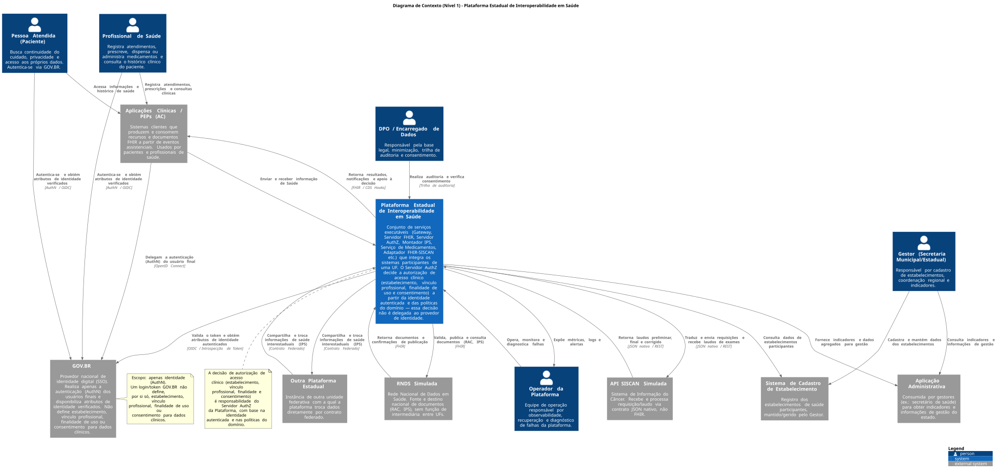

# Plataforma Estadual de Interoperabilidade em Saúde (Estratégia Prática de Design de Software)

> **Carga Horária:** 128 horas (sala 105, Centro de Aulas Aroeira)  
> **Domínio Mobilizador:** Interoperabilidade em Saúde  
> **Padronização Base:** FHIR R4 (`4.0.1`)  
> **Status:** Documento em evolução (Proposta de Design)

---

## 📌 Sobre o Projeto

Este repositório contém a **proposta de design arquitetural e especificação técnica** de uma plataforma estadual de interoperabilidade em saúde, estruturada como trabalho prático contínuo para a disciplina de **Design de Software**.

O objetivo central do projeto é o **aprendizado contínuo em Design de Software** explorando problemas reais de integração distribuída, tais como: definição de fronteiras, modelos de consistência, concorrência, idempotência, resiliência a falhas, evolução de contratos e atributos de qualidade.

> **⚠️ Aviso Importante / Finalidade Educacional:**  
> Este projeto **não** pretende reproduzir ou substituir a RNDS oficial, substituir sistemas de saúde de produção ou processar dados reais de pacientes. Sistemas externos nacionais e outras UFs são representados por simuladores e contratos controlados; **todos os dados previstos no design são estritamente sintéticos**.

---

## 🎯 Escopo e Foco do Sistema

O foco deste repositório está exclusivamente na **especificação dos serviços de interoperabilidade** que conectam sistemas participantes. Prontuários Eletrônicos (PEPs), portais de pacientes e sistemas departamentais de origem/destino **não** são o objeto de desenvolvimento principal e são previstos apenas como clientes/simuladores mínimos.

### Jornadas Clínicas Cobertas
1. **Continuidade do Cuidado:** Compartilhamento seguro de Registros de Atendimento Clínico (RAC) por atendimento e montagem/troca federada de Sumários Internacionais do Paciente (IPS).
2. **Rastreamento do Câncer do Colo do Útero:** Integração com o SISCAN por meio de um **Adaptador FHIR-SISCAN** que oferece uma fachada FHIR sobre a API nativa REST/JSON do governo.
3. **Ciclo do Medicamento:** Troca, correlação e notificação dos atos de prescrição, dispensação e administração de medicamentos entre diferentes prestadores.

---

---

## 🛠️ Arquitetura e Principais Componentes (C4 Level 2)

A solução é projetada com contêineres e serviços especializados para garantir a integração entre os sistemas:

* **Gateway de Integração:** Ponto de entrada que realiza autenticação, autorização, aplicação de limites (*rate limiting*) e roteamento de requisições.
* **Servidor FHIR R4:** Mantém o estado clínico sintético compartilhado para consultas e persistência.
* **Serviço de Documentos RNDS:** Gerencia a validação, publicação e reconciliação do ciclo de vida técnico de documentos (como RAC e IPS) na RNDS simulada.
* **Montador Efêmero de IPS:** Consolida e valida fatos clínicos de múltiplas fontes (RACs, laudos, medicamentos) para gerar um documento IPS com proveniência explícita e retenção efêmera (TTL de 60 min).
* **Adaptador de Interoperabilidade FHIR-SISCAN:** Fachada que traduz recursos FHIR (`ServiceRequest`, `DiagnosticReport`) em DTOs nativos para comunicação com a API SISCAN simulada.
* **Serviço de Interoperabilidade de Medicamentos:** Valida, mapeia e correlaciona prescrições, dispensações e administrações mantendo isolamento semântico dos atos.
* **Capacidades Transversais:** Validação de perfis/terminologias, validação de assinaturas digitais, mensageria via `Subscription` (FHIR R4), apoio à decisão síncrono com `CDS Hooks` e cálculo de indicadores com `CQL` (`Library`/`Measure`).

---

## 📂 Linhas de Base Técnicas Fixadas (Planejadas)

Para garantir a reprodutibilidade dos experimentos, os artefatos de entrada e pacotes de referência adotados pela arquitetura são:

| Domínio | Especificação / Pacote | Versão Fixada |
| :--- | :--- | :--- |
| **Padrão Base** | FHIR R4 | `4.0.1` |
| **RAC** | Modelo de Informação e Manual RNDS | `v2.0` |
| **IPS Brasil** | Pacote FHIR (`br.gov.saude.ips.fhir`) | `1.0.0 - STU1` (`package.tgz`) |
| **Medicamentos** | Pacotes REPM / REDFM da RNDS | `REDFM 1.0` / Pacotes combinados |
| **SISCAN** | Manual de Integração e Especificações OpenAPI | Manual `v3.0` / OpenAPI `v1.0` |

---

## 🚀 Estrutura de Incrementos de Implementação

O projeto é projetado para ser construído em 4 incrementos verticais:

[ Incremento 1 ] ──► Publicar RAC na RNDS simulada (Gateway + Validação + RNDS)
[ Incremento 2 ] ──► Integrar SISCAN via Adaptador FHIR (Requisição + Processamento + Laudo)
[ Incremento 3 ] ──► Registrar e Correlacionar Ciclo de Medicamentos
[ Incremento 4 ] ──► Montar IPS efêmero, Troca Interestadual Federada, Medidas CQL e CDS Hooks

---

## 📋 Pré-requisitos e Execução (Planejamento)

* **Ambiente de Desenvolvimento:** Definido conforme a pilha adotada pela turma/equipe.
* **Dados:** Utilizar **apenas dados sintéticos** (previstos nas especificações de teste).
* **Pacotes FHIR/OpenAPI:** Garantir que os pacotes locais especificados para a solução sejam carregados pelo validador local quando o ambiente for provisionado.

---

## 🤝 Diretrizes de Contribuição e Governança

1. **Decisões Registradas (ADR):** Qualquer mudança arquitetural ou escolha de alternativa relevante deve ser documentada via *Architecture Decision Record* (`ADR`).
2. **Contratos Primeiro:** Toda alteração de interface deve atualizar previamente as especificações OpenAPI ou Perfis FHIR correspondentes.
3. **Idempotência e Erros:** Todas as operações de escrita devem aceitar chaves de idempotência e retornar falhas semanticamente mapeadas via `OperationOutcome` ou DTOs oficiais.
4. **Privacidade e Logs:** É estritamente proibido gravar identificadores pessoais reais ou conteúdo clínico em logs, rastros e métricas de telemetria.

---

## 🤝 Contribuindo

Consulte a convenção completa e a configuração local em [CONTRIBUTING.md](CONTRIBUTING.md).

O merge em `main` é feito por *squash*: o título do PR vira a mensagem do commit.
Por isso, o título de cada PR deve seguir [Conventional Commits](https://www.conventionalcommits.org/pt-br/),
no formato `<tipo>[(escopo)][!]: <descrição>`, com tipo em `build`, `chore`, `ci`, `docs`,
`feat`, `fix`, `perf`, `refactor`, `revert`, `style` ou `test`.
Exemplo: `docs: adiciona diagrama de sequência de autorização de acesso`.

O check `conventional-commits` valida o título automaticamente em cada PR; basta editar o título para o check rodar de novo.

---

## 📄 Referências Normativas e Técnicas

* [Documento Prático da Disciplina e Materiais de Apoio](pratica.md)
* [Portal de Serviços DATASUS - RAC v2.0](https://portalservicos-datasus.saude.gov.br/servico/thZjxKwS4u)
* [HL7 Brasil - Guia do IPS Brasil STU1](https://hl7.org.br/fhir/ips/)
* [Portal de Serviços DATASUS - REDFM / REPM](https://portalservicos-datasus.saude.gov.br/servico/BBgfSNopOs)
* [Portal de Serviços DATASUS - API SISCAN](https://portalservicos-datasus.saude.gov.br/servico/EMZN1nuCWB)
