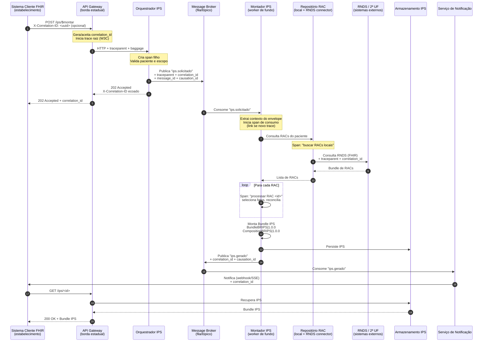

# Rastreamento Distribuído e Correlação de Eventos

> **Issue:** Projetar a arquitetura de rastreamento distribuído (*tracing*) e a estratégia de propagação de contexto para acompanhar requisições de ponta a ponta em sistemas assíncronos e distribuídos.
>
> **Arquivo-alvo:** `docs/observabilidade.md` — Seção "Rastreamento Distribuído e Correlação de Eventos"
>
> **Contexto de referência:** documento *10.1 RNDS, RAC e IPS* (Plataforma de Interoperabilidade em Saúde — instância estadual, FHIR R4, RAC como documento-fonte e IPS como síntese derivada).

---

## 1. Objetivo e escopo

Este documento define a arquitetura de **rastreamento distribuído** e a **estratégia de propagação de contexto** da Plataforma de Interoperabilidade em Saúde em sua instância estadual. O objetivo é permitir a correlação de eventos entre serviços síncronos (APIs FHIR), componentes assíncronos (mensageria, *workers* de fundo) e integrações externas (RNDS, segunda instância estadual, API SISCAN simulada).

O escopo cobre:

- Definição do mecanismo de correlação de eventos entre serviços e filas.
- Especificação de como o identificador de correlação trafega em HTTP, mensageria e *workers*.
- Seleção e mapeamento de um fluxo distribuído ponta a ponta como exemplo ilustrativo.
- Registro de decisões técnicas e dúvidas pendentes.

Estão **fora do escopo** deste documento: implementação de *backend* de tracing, escolha definitiva de fornecedor APM, políticas de amostragem em produção real e interfaces internas dos prestadores de saúde.

---

## 2. Decisões técnicas

### 2.1 Modelo de correlação em duas camadas

A plataforma adota **duas camadas complementares de identificação**, com finalidades distintas:

| Camada | Identificador | Padrão | Finalidade | Cardinalidade |
|---|---|---|---|---|
| Técnica | `trace_id` / `span_id` | W3C Trace Context | Rastreamento de execução, latência, causalidade, dependências | 1 `trace_id` por requisição raiz; N `span_id` por execução |
| Negócio | `correlation_id` | UUID v4 próprio da plataforma | Correlação de eventos de domínio entre sistemas e filas, inclusive quando o `trace` técnico é reiniciado | 1 por **intenção de negócio** (ex.: uma solicitação de IPS) |

**Justificativa:** o `trace_id` do W3C resolve causalidade técnica, mas *workers* assíncronos que consomem uma fila podem iniciar um novo *trace* quando o produtor e o consumidor estão em processos distintos e sem contexto ativo. O `correlation_id` de negócio **sobrevive** a esses reinícios porque é um atributo de domínio, não um artefato do *tracer*. Ele é o elo estável entre o pedido original e todos os eventos derivados.

### 2.2 Padrão adotado

- **W3C Trace Context** (`traceparent`, `tracestate`) como padrão técnico de propagação.
- **Baggage** W3C para propagar atributos de negócio leves e não sensíveis (ex.: `correlation_id`, `tenant_uf`, `patient_ref_pseudo`).
- **`X-Correlation-ID`** como cabeçalho HTTP explícito, aceito na borda e ecoado na resposta, para compatibilidade com clientes que não implementam W3C Baggage.

> **Restrição LGPD/segurança:** o `Baggage` **não** deve carregar dados pessoais identificáveis (CPF, CNS, nome). Apenas referências pseudonimizadas (ex.: hash estável do CNS) e metadados operacionais. Dados clínicos nunca trafegam em cabeçalhos de tracing.

### 2.3 Propagação em APIs HTTP (síncrono)

Toda chamada HTTP entre sistemas clientes FHIR, API Gateway, serviços internos e a segunda instância estadual deve carregar:

```
traceparent: 00-<trace-id>-<parent-span-id>-<flags>
tracestate:  <vendor>=<value>
baggage:      correlation_id=<uuid>,tenant_uf=<UF>,patient_ref_pseudo=<hash>
X-Correlation-ID: <uuid>
```

Regras:

1. A **borda** (API Gateway) aceita `X-Correlation-ID` do cliente; se ausente, gera um novo UUID v4 e o injeta no contexto.
2. Cada serviço interno cria um `span` filho e propaga os cabeçalhos adiante.
3. A resposta inclui `X-Correlation-ID` e `traceparent` para que o cliente possa reportar problemas com contexto.
4. Erros de negócio (`OperationOutcome` FHIR) devem incluir `correlation_id` em `OperationOutcome.issue.diagnostics` ou em extensão própria, sem expor dados sensíveis.

### 2.4 Propagação em mensageria (assíncrono)

Corretores de mensagem (fila/tópico) **não** herdam contexto de execução automaticamente. A estratégia é transportar o contexto **no envelope da mensagem**, não no corpo clínico FHIR.

**Cabeçalhos de mensagem obrigatórios:**

| Cabeçalho | Origem | Obrigatório |
|---|---|---|
| `traceparent` | contexto W3C ativo no produtor | Sim |
| `tracestate` | contexto W3C ativo no produtor | Se presente |
| `correlation_id` | bagagem de negócio | Sim |
| `causation_id` | `message_id` do evento que originou este | Sim (quando aplicável) |
| `message_id` | UUID único da mensagem | Sim |
| `published_at` | timestamp ISO-8601 UTC | Sim |
| `schema_version` | versão do contrato do evento | Sim |

**Regra do consumidor:**

1. Ao consumir, o *worker* extrai `traceparent` e `correlation_id` do envelope.
2. Cria um **novo span de consumo** vinculado ao `traceparent` recebido (quando o produtor ainda está no mesmo *trace*) ou **inicia um novo trace** com `links` apontando para o `message_id` e `correlation_id` (quando o contexto técnico se perdeu).
3. Reinjeta `correlation_id` no contexto local para que chamadas HTTP subsequentes (ex.: consulta à RNDS) o propaguem.
4. Em caso de *retry*, o `message_id` original é preservado; um novo `span` de tentativa é criado.

> **Decisão:** adotar **links** (atributo de span) em vez de forçar a continuidade do `trace_id` quando a mensagem for reprocessada após falha. Isso evita *traces* artificialmente longos e reflete a realidade operacional (o reprocessamento é um novo evento causal, não a mesma execução).

### 2.5 Propagação em *workers* de fundo

*Workers* de fundo (ex.: Montador IPS, Serviço de Interoperabilidade de Medicamentos) executam sem requisição HTTP ativa. Estratégia:

1. **Contexto explícito no job:** todo job persistido ou enfileirado carrega `correlation_id` e `traceparent` no payload de controle (não no payload clínico).
2. **Context storage local:** o *worker* mantém um `ContextVar`/`ThreadLocal` com o contexto ativo durante o processamento, restaurando-o a cada iteração.
3. **Spans de longa duração:** operações que atravessam múltiplos lotes (ex.: montagem de IPS a partir de N RACs) geram um `span` por fonte consultada, todos filhos do mesmo `correlation_id`.
4. **Encerramento explícito:** ao final do job, o *worker* publica um evento de conclusão carregando `causation_id = message_id` do evento que o originou.

### 2.6 Armazenamento, retenção e amostragem

- **Armazenamento:** *backend* compatível com OpenTelemetry (OTLP). Para a disciplina, assume-se um *collector* local + armazenamento em arquivo/objeto, sem dependência de APM comercial.
- **Retenção:** *traces* técnicos retidos por período curto (ex.: 7 dias); `correlation_id` e eventos de domínio retidos por período compatível com auditoria clínica (a definir com a disciplina).
- **Amostragem:** 100% em ambiente de disciplina; em produção, amostragem por cabeça com *tail sampling* para erros e fluxos críticos (ex.: montagem de IPS).
- **Sem dados clínicos:** *spans* e atributos não devem conter conteúdo de RAC, IPS, prescrição ou laudo. Apenas referências (`Bundle.id`, `Composition.id`, `patient_ref_pseudo`).

---

## 3. Fluxo distribuído ilustrativo: **Montagem de IPS sob demanda**

### 3.1 Justificativa da escolha

O fluxo de **montagem de IPS** foi escolhido porque:

- É **intrinsecamente assíncrono** (o Montador consolida fatos de múltiplas fontes).
- Envolve **múltiplos componentes** da arquitetura (API, mensageria, *worker*, conectores externos, repositório).
- Exige **correlação entre RACs e a síntese IPS**, exatamente o ponto onde a perda de contexto em mensageria é mais crítica.
- Está alinhado ao documento de contexto (seções 10.1, 10.3 e 10.4): o IPS é derivado de um ou mais RACs e de outras fontes da RNDS.

### 3.2 Pré-condições

- Existem um ou mais RACs publicados na RNDS ou no repositório local da plataforma para o paciente.
- O sistema cliente solicitou a geração de um IPS via API FHIR da plataforma estadual.
- O `correlation_id` foi gerado na borda (ou aceito do cliente).

### 3.3 Diagrama de sequência (Mermaid)



### 3.4 Mapeamento da jornada por componente

| # | Componente | Papel no fluxo | Contexto recebido | Contexto emitido | Observação |
|---|---|---|---|---|---|
| 1 | Sistema Cliente FHIR | Origem da intenção | — | `X-Correlation-ID` (opcional) | Pode ou não enviar; borda gera se ausente |
| 2 | API Gateway | Borda, autenticação, geração de `correlation_id` | `X-Correlation-ID` | `traceparent`, `baggage`, `X-Correlation-ID` | Ponto onde o `trace` raiz é iniciado |
| 3 | Orquestrador IPS | Validação e publicação de comando | `traceparent`, `baggage` | Mensagem com envelope de contexto | Cria `span` filho |
| 4 | Message Broker | Transporte assíncrono | Envelope da mensagem | Envelope preservado | **Ponto crítico de perda de contexto** |
| 5 | Montador IPS | Consumo e montagem | Envelope da mensagem | Novos `spans`, eventos derivados | Restaura contexto do envelope |
| 6 | Repositório RAC / Conector RNDS | Fonte de fatos | `traceparent`, `correlation_id` | Bundle de RACs | Propaga para sistemas externos |
| 7 | RNDS / 2ª UF | Sistemas externos | `traceparent`, `correlation_id` | Dados FHIR | Autoridades sobre seus contratos |
| 8 | Armazenamento IPS | Persistência da síntese | `correlation_id` em metadados | — | Não propaga para fora |
| 9 | Serviço de Notificação | Notifica cliente | Envelope da mensagem | Webhook/SSE com `correlation_id` | Fecha o ciclo com o cliente |

### 3.5 Como o rastreamento atravessa cada salto

- **HTTP (cliente → gateway → orquestrador):** `traceparent` e `baggage` seguem no cabeçalho; o `correlation_id` é gerado ou aceito na borda.
- **HTTP → mensageria (orquestrador → broker):** o orquestrador copia `traceparent` e `correlation_id` para o **envelope** da mensagem (cabeçalhos do broker), não para o corpo clínico.
- **Mensageria → worker (broker → Montador):** o Montador extrai o contexto do envelope; se o `trace` original ainda for válido, cria `span` filho; se não, inicia novo `trace` com `links` para `message_id` e `correlation_id`.
- **Worker → HTTP externo (Montador → RNDS / 2ª UF):** o contexto restaurado é reinjetado nos cabeçalhos HTTP; a RNDS e a 2ª UF são tratadas como sistemas externos que podem ou não propagar de volta.
- **Worker → mensageria → notificação:** o evento `ips.gerado` carrega `causation_id = message_id` do evento `ips.solicitado`, preservando a cadeia causal mesmo entre *traces* técnicos distintos.
- **Cliente final:** recebe `correlation_id` na resposta inicial (202) e na notificação, permitindo correlacionar o pedido, o processamento e o resultado.

### 3.6 Resolução da perda de contexto em chamadas assíncronas

O problema central — *“o worker que consome a fila não tem o contexto da requisição HTTP original”* — é resolvido por três mecanismos combinados:

1. **Envelope de mensagem como veículo de contexto:** o `traceparent` e o `correlation_id` viajam **com a mensagem**, não com o processo. Isso desacopla o contexto do tempo de vida do processo produtor.
2. **`correlation_id` como âncora de negócio:** mesmo que o `trace_id` técnico seja reiniciado no consumidor, o `correlation_id` permanece estável e permite reconstruir a jornada completa por consulta ao *backend* de tracing (busca por `correlation_id`).
3. **`causation_id` como elo causal explícito:** cada evento derivado aponta para o `message_id` do evento que o originou, formando um grafo causal independente do `trace` técnico. Isso é essencial para fluxos como o do IPS, em que um RAC pode gerar múltiplos eventos e um IPS pode ser derivado de N RACs.

> **Resultado:** a jornada completa é reconstruível a partir de **qualquer** um dos três identificadores: `correlation_id` (visão de negócio), `trace_id` (visão técnica) ou `causation_id` (visão causal entre eventos).

---

## 4. Registro de decisões técnicas

| # | Decisão | Alternativas consideradas | Justificativa | Status |
|---|---|---|---|---|
| D1 | Adotar W3C Trace Context como padrão técnico | Zipkin B3, Jaeger, proprietário | Padrão aberto, amplamente suportado, compatível com OpenTelemetry | Aceita |
| D2 | Manter `correlation_id` de negócio separado do `trace_id` técnico | Usar apenas `trace_id`; usar apenas `correlation_id` | `trace_id` pode ser reiniciado em consumidores assíncronos; `correlation_id` sobrevive a reinícios e é compreensível por áreas de negócio | Aceita |
| D3 | Transportar contexto no **envelope** da mensagem, não no corpo FHIR | Cabeçalhos HTTP apenas; corpo FHIR | Corpo FHIR é contrato clínico e não deve carregar metadados operacionais; envelope é o lugar canônico | Aceita |
| D4 | Usar **links** em vez de continuidade forçada de `trace` em reprocessamento | Forçar `trace_id` único; ignorar causalidade | Evita *traces* artificialmente longos e reflete a realidade operacional de retry | Aceita |
| D5 | Não propagar dados pessoais em `baggage`/cabeçalhos | Incluir CNS/CPF para facilitar correlação | Conformidade LGPD; pseudonimização obrigatória | Aceita |
| D6 | Amostragem 100% na disciplina; *tail sampling* em produção | Amostragem por cabeça uniforme | Fluxos críticos (IPS, medicamentos) precisam de rastreio completo em falhas | Provisória (depende de ambiente real) |
| D7 | *Backend* OTLP-compatível com armazenamento local na disciplina | APM comercial; Jaeger dedicado | Independência de fornecedor e reprodutibilidade na disciplina | Aceita para a disciplina |
| D8 | Escolher o fluxo de **montagem de IPS** como exemplo ilustrativo | Fluxo de medicamentos (REPM/REDFM); fluxo SISCAN | IPS é o fluxo mais claramente assíncrono e multi-fonte do contexto; já é central no projeto | Aceita |

---

## 5. Dúvidas pendentes para refinamento técnico futuro

1. **Amostragem em produção:** qual a política de *tail sampling* adequada para fluxos clínicos críticos, considerando custo de armazenamento e requisitos de auditoria?
2. **Retenção de `correlation_id`:** por quanto tempo o `correlation_id` e os eventos de domínio devem ser retidos para fins de auditoria clínica? Há requisito regulatório aplicável (CFM, ANVISA, LGPD)?
3. **Federação entre UFs:** como a segunda instância estadual deve tratar o `traceparent` recebido? Ela deve continuar o `trace` ou iniciar um novo com `links`? Há implicação de soberania de dados?
4. **RNDS:** a RNDS propaga cabeçalhos W3C de volta? Se não, como correlacionar chamadas à RNDS com o `correlation_id` local?
5. **SISCAN (simulador):** o simulador contratual deve propagar contexto de tracing? Em caso positivo, qual o formato esperado (W3C, B3, proprietário)?
6. **Medicamentos (REPM/REDFM):** como correlacionar prescrição e dispensação quando os atos ocorrem em organizações distintas? O `correlation_id` deve ser gerado pelo prescritor ou pela plataforma?
7. **Padrão de nomenclatura de spans:** definir convenção (ex.: `http.server`, `messaging.consume`, `fhir.query`) alinhada às Semantic Conventions do OpenTelemetry.
8. **Validação de contexto:** como tratar mensagens que chegam sem `traceparent` (ex.: publicadas por sistemas legados)? Bloquear, aceitar com `correlation_id` gerado, ou aceitar sem tracing?
9. **Observabilidade de dados clínicos:** como garantir que *spans* e *logs* não vazem dados pessoais, considerando que nomes de recursos FHIR podem conter identificadores?
10. **Testes de tracing:** como validar a propagação ponta a ponta na disciplina sem depender de infraestrutura de produção? Há necessidade de um *collector* mockado?

---

## 6. Aderência aos critérios de aceite

| Critério | Como é atendido |
|---|---|
| O fluxo selecionado demonstra rastreabilidade ponta a ponta interligando os componentes da arquitetura | Seções 3.3 e 3.4 mapeiam o fluxo de montagem de IPS do cliente à notificação, passando por API, orquestrador, broker, Montador, repositório, RNDS e armazenamento |
| A estratégia resolve a perda de contexto em chamadas assíncronas/mensageria | Seção 3.6 descreve os três mecanismos combinados (envelope, `correlation_id` de negócio, `causation_id`) que garantem reconstrução da jornada mesmo com reinício de `trace` técnico |
| Registro das decisões técnicas e dúvidas pendentes para refinamento técnico futuro | Seções 4 e 5 |

---

## 7. Referências internas

- Documento de contexto *10.1 RNDS, RAC e IPS* (seções 10.1 a 10.4, 10.6 e 11).
- Perfil canônico RAC: `http://www.saude.gov.br/fhir/r4/StructureDefinition/BRRegistroAtendimentoClinico`.
- Perfis IPS: `BundleBRIPS|1.0.0` e `CompositionBRIPS|1.0.0` (pacote `br.gov.saude.ips.fhir#1.0.0`, dependência `hl7.fhir.uv.ips#1.1.0`).
- W3C Trace Context — Recommendation.
- W3C Baggage — Recommendation.
- OpenTelemetry Semantic Conventions.

---

## 8. Histórico de revisões

| Versão | Data | Autor | Descrição |
|---|---|---|---|
| 0.1 | — | — | Versão inicial para revisão da issue de observabilidade |

---

> **Nota para revisão:** este documento trata a linha de base técnica (RAC 2.0, IPS 1.0.0-STU1, REDFM 1.0) como **cópia versionada fixada**, sem atualização automática, conforme orientação do documento de contexto. Decisões marcadas como *Provisória* dependem de validação com a coordenação da disciplina e/ou com o ambiente real de produção.
