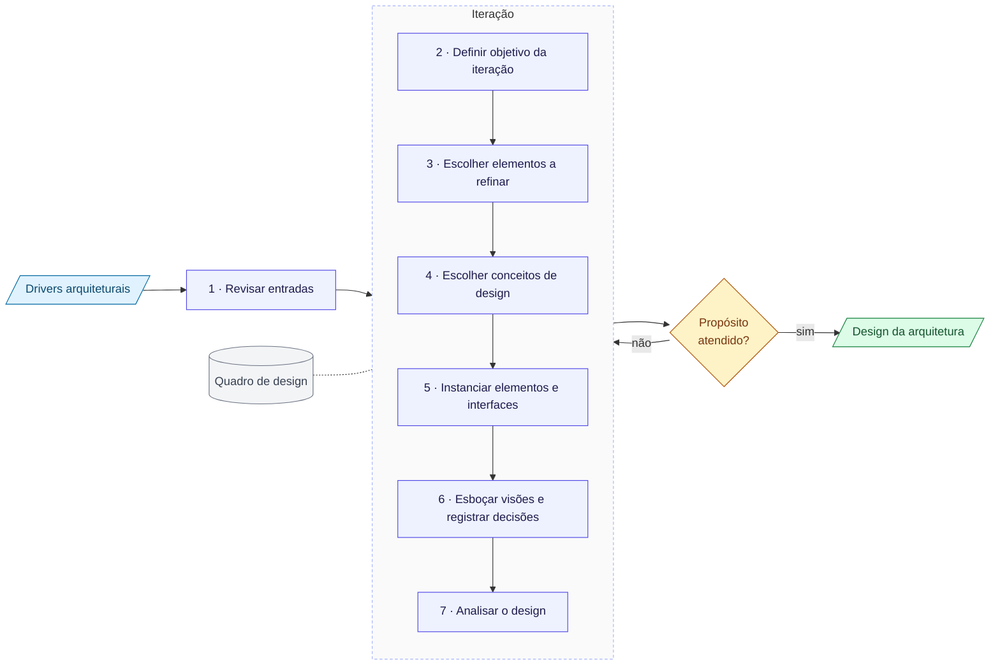

# Modelo: Attribute-Driven Design (ADD 3.0)

> Modelo para preencher. Explica as entradas, os sete passos e as saídas do ADD 3.0, conforme Cervantes e Kazman (*Designing Software Architectures*, 2016). Os campos entre `[colchetes]` devem ser preenchidos pela equipe.

## O que é o ADD

O **Attribute-Driven Design** é um método de design de arquitetura de software do SEI (Software Engineering Institute, Carnegie Mellon). Sua ideia central é que a arquitetura é guiada pelos **atributos de qualidade** e pelos demais **drivers arquiteturais**, e não apenas pela funcionalidade.

O método recebe os drivers como entrada e produz o design da arquitetura por meio de **iterações**. O passo 1 é executado no início; os passos 2 a 7 se repetem a cada iteração, até que o propósito do design seja atendido.

## Diagrama do método

**Legenda.** Azul-claro: entradas. Lilás: passos do método. Amarelo: decisão de continuar. Verde: saída. Cinza: quadro de design, consultado no passo 2 e atualizado no passo 7.

## Como usar este modelo

1. Preencha as **entradas** antes de começar as iterações.
2. Execute o **passo 1** uma vez, revisando as entradas.
3. Para cada iteração, copie a seção **Registro da iteração** e preencha os passos 2 a 7.
4. Atualize o **quadro de design** ao fim de cada iteração (passo 7).
5. Pare quando o propósito do design for atendido, conforme a seção **Quando parar**.

---

## Entradas do ADD (drivers arquiteturais)

O ADD trabalha com cinco tipos de entrada.

### 1. Propósito do design

**O que é.** Para que serve o design que está sendo produzido. O propósito influencia quanto detalhe é necessário e em que ordem as decisões são tomadas.

**Tipos citados pelo método.**

| Tipo | Significado |
| --- | --- |
| *Greenfield* em domínio maduro | Sistema novo em um domínio bem conhecido, com soluções de referência disponíveis |
| *Greenfield* em domínio novo | Sistema novo em um domínio pouco explorado, com menos soluções de referência |
| *Brownfield* | Alteração de um sistema existente |

O propósito também pode indicar para que o design será usado, por exemplo para estimativa, para prototipagem ou para orientar a construção.

**Preencher.**

| Campo | Conteúdo |
| --- | --- |
| Tipo de sistema | `[...]` |
| Uso pretendido do design | `[...]` |

### 2. Funcionalidade primária

**O que é.** Os casos de uso ou histórias que são mais importantes para o negócio e que mais influenciam a estrutura do sistema. Não é a lista completa de requisitos funcionais.

**Preencher.**

| ID | Caso de uso / história | Por que é primário |
| --- | --- | --- |
| UC-01 | `[...]` | `[...]` |

### 3. Cenários de atributos de qualidade

**O que é.** Os atributos de qualidade expressos em cenários mensuráveis, no formato de seis partes de Bass, Clements e Kazman.

| Parte | Significado |
| --- | --- |
| Fonte | Quem ou o que gera o estímulo |
| Estímulo | O evento ou a condição que chega ao sistema |
| Artefato | A parte do sistema afetada |
| Ambiente | Em que condição o sistema está quando o estímulo chega |
| Resposta | O que o sistema deve fazer |
| Medida da resposta | Como verificar objetivamente que a resposta foi atingida |

**Priorização.** Cada cenário recebe duas notas — **importância** para os stakeholders e **dificuldade** técnica — em alta, média ou baixa. Os cenários mais importantes e mais difíceis tendem a ser os mais significativos para a arquitetura.

**Preencher.**

| ID | Atributo | Fonte | Estímulo | Artefato | Ambiente | Resposta | Medida | Importância (A/M/B) | Dificuldade (A/M/B) |
| --- | --- | --- | --- | --- | --- | --- | --- | --- | --- |
| CQ-01 | `[...]` | `[...]` | `[...]` | `[...]` | `[...]` | `[...]` | `[...]` | `[...]` | `[...]` |

### 4. Restrições

**O que é.** Decisões já tomadas que a equipe não pode alterar: tecnologias obrigatórias, padrões, normas, interoperabilidade com sistemas existentes, prazos.

**Preencher.**

| ID | Restrição | Origem |
| --- | --- | --- |
| RES-01 | `[...]` | `[...]` |

### 5. Preocupações arquiteturais

**O que é.** Questões que precisam ser tratadas pela arquitetura mesmo sem aparecer como requisito explícito. O método cita como categorias:

| Categoria | Exemplos de tema |
| --- | --- |
| Gerais | Estrutura geral do sistema, organização do código |
| Específicas | Tratamento de exceções, logging, autenticação, configuração |
| Requisitos internos | Necessidades da própria equipe de desenvolvimento, teste ou implantação |
| Problemas | Questões resultantes de análises anteriores ou de dívida técnica |

**Preencher.**

| ID | Preocupação | Categoria |
| --- | --- | --- |
| PA-01 | `[...]` | `[...]` |

---

## Passo 1 — Revisar as entradas

**O que é.** Garantir que os drivers estão disponíveis, compreendidos e priorizados antes de iniciar o design.

**Por que importa.** As decisões das iterações são justificadas contra os drivers. Drivers ausentes ou ambíguos geram decisões sem base.

**Perguntas-guia.**

- O propósito do design está claro?
- A funcionalidade primária está identificada?
- Os cenários de qualidade estão no formato de seis partes e priorizados?
- As restrições e as preocupações arquiteturais estão registradas?

**Resultado do passo.** Lista de drivers revisada e priorizada; quadro de design iniciado com todos os drivers na coluna "não tratado".

**Preencher.**

| Driver | Revisado? | Observação |
| --- | --- | --- |
| `[...]` | `[ ]` | `[...]` |

---

## Registro da iteração

> Copie esta seção para cada iteração.

**Iteração nº:** `[...]`

### Passo 2 — Definir o objetivo da iteração selecionando drivers

**O que é.** Escolher quais drivers serão tratados nesta iteração e expressar o objetivo da iteração.

**Por que importa.** Cada iteração tem foco. Tentar tratar todos os drivers de uma vez esconde as trocas entre eles.

**Observação do método.** Em sistemas *greenfield*, o livro sugere que a primeira iteração trate do estabelecimento da estrutura geral do sistema, e que as iterações seguintes tratem da funcionalidade primária e dos cenários de qualidade e preocupações restantes.

**Preencher.**

| Campo | Conteúdo |
| --- | --- |
| Objetivo da iteração | `[...]` |
| Drivers selecionados | `[IDs]` |

### Passo 3 — Escolher um ou mais elementos do sistema para refinar

**O que é.** Decidir qual parte do sistema será decomposta ou refinada para atender aos drivers selecionados.

**Por que importa.** O design avança por refinamento: o sistema inteiro na primeira iteração; depois, elementos criados em iterações anteriores.

**Preencher.**

| Elemento a refinar | Motivo da escolha |
| --- | --- |
| `[...]` | `[...]` |

### Passo 4 — Escolher um ou mais conceitos de design que satisfaçam os drivers selecionados

**O que é.** Selecionar as soluções de design que serão usadas para atender aos drivers da iteração.

**Tipos de conceito de design citados pelo método.**

| Tipo | Significado |
| --- | --- |
| Arquiteturas de referência | Estruturas de referência para uma classe de aplicações |
| Padrões arquiteturais e de design | Soluções conceituais para problemas recorrentes |
| Padrões de implantação | Soluções para a distribuição física dos elementos |
| Táticas | Técnicas para controlar a resposta de um atributo de qualidade |
| Componentes desenvolvidos externamente | Frameworks, produtos e bibliotecas prontos |

**Por que importa.** É neste passo que as opções são identificadas, comparadas e selecionadas. O método recomenda registrar as alternativas consideradas e a justificativa da escolha.

**Preencher.**

| Conceito candidato | Tipo | Drivers que atende | Prós | Contras | Selecionado? |
| --- | --- | --- | --- | --- | --- |
| `[...]` | `[...]` | `[IDs]` | `[...]` | `[...]` | `[ ]` |

### Passo 5 — Instanciar elementos arquiteturais, alocar responsabilidades e definir interfaces

**O que é.** Transformar os conceitos escolhidos em elementos concretos do sistema, atribuir a cada um suas responsabilidades e definir as interfaces entre eles.

**Por que importa.** Um conceito como "padrão em camadas" ou "tática de redundância" só vira arquitetura quando é aplicado a elementos específicos do sistema.

**Preencher.**

| Elemento | Responsabilidades | Interfaces (oferecidas / consumidas) |
| --- | --- | --- |
| `[...]` | `[...]` | `[...]` |

### Passo 6 — Esboçar visões e registrar decisões de design

**O que é.** Representar o design em visões e registrar as decisões tomadas na iteração, com sua justificativa.

**Visões.** O método usa esboços das visões arquiteturais, como visões de módulos, de componentes e conectores e de alocação (implantação). Os esboços podem ser informais durante as iterações.

**Registro das decisões.** O ADD pede que decisões e justificativas sejam registradas, sem impor um formato. Um formato comum é o ADR (*Architecture Decision Record*), que não faz parte do método.

**Preencher.**

| Visão esboçada | Tipo (módulos, componentes e conectores, alocação) | Localização do esboço |
| --- | --- | --- |
| `[...]` | `[...]` | `[...]` |

| Decisão de design | Justificativa | Drivers relacionados |
| --- | --- | --- |
| `[...]` | `[...]` | `[IDs]` |

### Passo 7 — Analisar o design atual e revisar o objetivo da iteração e o atendimento do propósito do design

**O que é.** Verificar se as decisões da iteração atenderam aos drivers selecionados e se o design, como um todo, já atende ao propósito definido.

**Por que importa.** A análise decide se haverá nova iteração e quais drivers ela deve tratar.

**Atividade principal.** Atualizar o quadro de design, movendo cada driver para "não tratado", "parcialmente tratado" ou "tratado".

**Perguntas-guia.**

- Os drivers selecionados no passo 2 foram atendidos?
- Surgiram novos drivers ou preocupações durante a iteração?
- O propósito do design já foi atingido?

**Preencher.**

| Driver | Estado após a iteração | Justificativa |
| --- | --- | --- |
| `[ID]` | `[não tratado / parcialmente tratado / tratado]` | `[...]` |

| Campo | Conteúdo |
| --- | --- |
| Objetivo da iteração atingido? | `[...]` |
| Nova iteração necessária? | `[...]` |
| Drivers candidatos à próxima iteração | `[IDs]` |

---

## Quadro de design (kanban)

**O que é.** Ferramenta usada pelo método para acompanhar o progresso do design. Cada driver é um cartão que se move entre três colunas ao longo das iterações.

| Driver | Não tratado | Parcialmente tratado | Tratado |
| --- | --- | --- | --- |
| `[ID]` | `[ ]` | `[ ]` | `[ ]` |

## Quando parar

O método indica que as iterações continuam até que o propósito do design seja atingido. Na prática, o livro associa isso a ter os drivers mais importantes tratados, ou ao fim do tempo e dos recursos disponíveis para o design.

| Campo | Conteúdo |
| --- | --- |
| Drivers prioritários tratados? | `[...]` |
| Drivers que permanecem em aberto | `[IDs]` |
| Propósito do design atingido? | `[...]` |

## Saída do ADD

A saída do método é o **design da arquitetura de software**, refinado a cada iteração e composto por:

- as visões esboçadas;
- os elementos com suas responsabilidades e interfaces;
- as decisões de design registradas com suas justificativas;
- o estado final do quadro de design.

## Referências

- Cervantes, H.; Kazman, R. *Designing Software Architectures: A Practical Approach*. Addison-Wesley, 2016.
- Bass, L.; Clements, P.; Kazman, R. *Software Architecture in Practice*. 4ª ed. Addison-Wesley, 2021.
