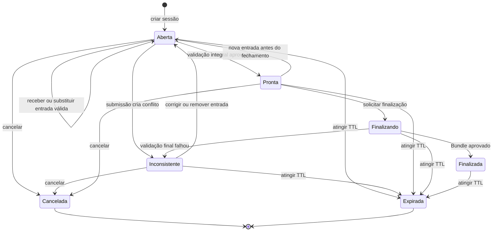
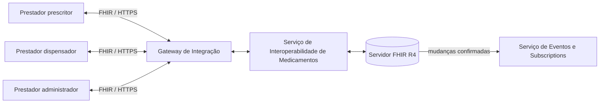

# Proposta de arquitetura para uma plataforma de interoperabilidade em saúde

> - Domínio: interoperabilidade em saúde
> - Contexto: estabelecimentos de saúde em geral
> - Equipe: oito integrantes, sob coordenação do responsável pelo repositório
> - Planejamento: fases e marcos, com esforço e prazos definidos em conjunto
> - Status: proposta em evolução, apoiada por protótipos selecionados.

## 1. Finalidade

Este documento define o trabalho de uma equipe de desenvolvimento de software responsável pela proposta de arquitetura de alto nível de uma plataforma estadual de interoperabilidade em saúde baseada em HL7 Fast Healthcare Interoperability Resources (FHIR).

A entrega principal é a **proposta de arquitetura**, com fronteiras, responsabilidades, contratos, alternativas, decisões justificadas e cenários de qualidade. Protótipos e simuladores serão construídos pela equipe nos recortes selecionados em conjunto para verificar decisões e reduzir riscos; não se exige implementar integralmente todos os fluxos descritos neste documento.

O foco é a **qualidade das decisões de Design de Software e das evidências que as sustentam**, não a quantidade de código. A linguagem e os artefatos devem refletir um cenário real de desenvolvimento, com responsabilidades, decisões, riscos e entregas explícitos.

FHIR, Registro de Atendimento Clínico (RAC), Sumário Internacional do Paciente (IPS), Sistema de Informação do Câncer (SISCAN), Clinical Quality Language (CQL), CDS Hooks, Subscription e os modelos de medicamentos são restrições, contratos e fontes de problemas reais para a prática de design.

O trabalho não pretende reproduzir ou substituir a RNDS (Rede Nacional de Dados em Saúde), substituir sistemas oficiais ou processar dados reais de pacientes. Sistemas externos serão representados por simuladores e contratos controlados. Os protótipos não constituem uma plataforma de produção nem demonstram, por si, segurança para uso clínico real.

As decisões de projeto são conjuntas, sob coordenação do responsável pelo repositório. Java e Spring Boot formam a plataforma básica; HAPI FHIR será usado para o servidor FHIR e o validador. As decisões confirmadas e as pendências estão na seção 27. As orientações operacionais para agentes de desenvolvimento ficam em [AGENTS.md](AGENTS.md), sem substituir este documento como definição do trabalho.

## 2. Foco: serviços de interoperabilidade entre sistemas participantes

O foco do trabalho **não está nas aplicações clínicas de origem e destino**, ou seja, nas aplicações que produzem e consomem informações em saúde. Noutras palavras, prontuários, portais de pacientes ou sistemas departamentais que produzem e consomem informações serão representados por sistemas clientes mínimos, capazes de enviar e receber recursos FHIR e acionar os fluxos necessários às demonstrações da proposta de design. 

O objeto de projeto são os **serviços de interoperabilidade que conectam esses sistemas**. A implementação se limita aos protótipos e simuladores selecionados para verificar a proposta.

Noutras palavras, inclui gateway, contratos e perfis FHIR, troca federada direta entre plataformas estaduais, validação e terminologia, adaptadores para contratos externos não FHIR, publicação e consulta de documentos na RNDS, montagem de IPS, interoperabilidade de medicamentos, notificações, medidas clínicas, apoio à decisão, identidade, segurança da informação, auditoria e observabilidade. A interface de um sistema cliente só será detalhada quando necessário para exercitar ou avaliar um desses serviços.

Essa delimitação evita que a equipe construa vários prontuários incompletos e concentra o esforço nos problemas de integração: fronteiras, responsabilidades, protocolos, estados distribuídos, concorrência, falhas, evolução e atributos de qualidade.

## 3. Problema central

> Como projetar uma infraestrutura estadual que permita a estabelecimentos com sistemas heterogêneos compartilhar informações em saúde?

A questão é explorada por meio do compartilhamento seguro de RACs e sínteses clínicas, da produção e troca interestadual de IPS, da integração com sistemas externos de contratos distintos, da interoperabilidade de medicamentos, do apoio à decisão no ponto de cuidado e da avaliação da qualidade da assistência.

O problema reúne três jornadas clínicas complementares:

1. Continuidade do cuidado por meio do compartilhamento de RACs por atendimento e da montagem e troca de um IPS derivado de múltiplas fontes entre estabelecimentos, municípios e estados.
2. Rastreamento do câncer do colo do útero, com requisição e laudo trocados com a API nativa do SISCAN por meio de um **Adaptador de Interoperabilidade FHIR-SISCAN**, que oferece uma fachada FHIR sobre esse contrato não FHIR.
3. Interoperabilidade do ciclo do medicamento: os atos de prescrever, dispensar e administrar continuam sob responsabilidade dos prestadores de serviços de saúde; o trabalho projeta o serviço que permite trocar e correlacionar essas informações entre quem prescreve, quem dispensa e quem administra.

As jornadas clínicas fornecem os eventos e os dados que justificam os serviços, mas a equipe não implementará a atividade assistencial dos sistemas de origem. As jornadas compartilham capacidades transversais: identidade, autorização, auditoria, validação FHIR, terminologia, eventos, persistência, tratamento de falhas, apoio à decisão e avaliação da qualidade.

## 4. Visão executiva do domínio

Nem todo nome citado no problema representa um componente de software. Para evitar essa confusão, o documento usa as seguintes categorias:

| Categoria | Elementos principais | Como interpretá-los |
| --- | --- | --- |
| Pessoas | pessoa atendida, profissionais e gestores | Interagem com sistemas e possuem necessidades que orientam os requisitos |
| Sistemas clientes | PEPs e aplicações clínicas simuladas | Produzem ou consomem informações por meio dos contratos da plataforma |
| Sistemas externos | plataforma estadual par, RNDS e SISCAN | Sistemas com contratos próprios, representados por simuladores |
| Documentos e modelos de informação | RAC, IPS, REPM e REDFM | Definem a semântica e a estrutura dos dados trocados; não são processos executáveis |
| Componentes da plataforma | Gateway, Servidor FHIR, Serviço de Documentos RNDS, Montador IPS, Serviço de Medicamentos e Adaptador FHIR-SISCAN | Serviços executáveis que integram os sistemas participantes e implementam decisões de design |
| Capacidades transversais | validação, terminologia, Subscription, CQL, CDS Hooks, segurança da informação, segurança clínica, auditoria e observabilidade | Apoiam várias jornadas e componentes |
| Padrão-base | FHIR R4 | Modelo e protocolo comum usado nos contratos clínicos da plataforma |

Em particular, RAC e IPS são tipos de documento clínico, não componentes. O **Serviço de Documentos RNDS** publica e gerencia o ciclo técnico desses documentos na RNDS simulada; o **Montador Efêmero de IPS** produz uma nova síntese clínica.

## 5. Glossário mínimo

| Termo | Significado neste trabalho |
| --- | --- |
| PEP | Prontuário Eletrônico do Paciente; representa um sistema cliente produtor ou consumidor de informações |
| Plataforma estadual par | Instância de outra UF com a qual a plataforma em foco troca dados diretamente por um contrato federado |
| RNDS | Rede Nacional de Dados em Saúde; fonte e destino nacionais de documentos e registros, sem função de intermediária na troca entre UFs |
| RAC | Documento FHIR sobre o que ocorreu em um atendimento clínico específico |
| IPS | Documento FHIR que sintetiza informações essenciais provenientes de múltiplos atendimentos e fontes |
| SISCAN | Sistema nacional de informação do câncer, acessado por sua API nativa simulada |
| REPM / REDFM | Modelos nacionais para prescrição e dispensação ou fornecimento de medicamentos |
| Subscription | Mecanismo FHIR de detecção de mudanças e notificação |
| CQL | Linguagem para expressar lógica clínica computável e medidas |
| CDS Hooks | Especificação para acionar serviços de apoio à decisão no fluxo de trabalho clínico |
| ASR | *Architecturally Significant Requirement*; requisito que influencia decisões arquiteturais |
| ADR | *Architecture Decision Record*; registro curto de uma decisão, suas alternativas e consequências |
| DTO | *Data Transfer Object*; estrutura de dados de uma API, sem implicar equivalência com um recurso FHIR |
| OAS | *OpenAPI Specification*; descrição executável de um contrato HTTP |
| TTL | *Time to Live*; prazo máximo de existência de um dado temporário |
| JWT | *JSON Web Token*; formato de token usado nos cenários de autenticação simulada |
| LGPD | Lei Geral de Proteção de Dados Pessoais |

## 6. Encadeamento do sistema em sete passos

1. (Marina) Um PEP simulado produz recursos ou documentos FHIR a partir de um evento assistencial sintético.
2. (Cristina) O Gateway autentica, aplica políticas e encaminha a solicitação ao serviço responsável.
3. Serviços especializados validam, correlacionam ou traduzem a informação sem substituir a responsabilidade clínica dos sistemas de origem e dos profissionais responsáveis.
4. (Caio) Em uma troca interestadual, o Gateway da plataforma de origem entrega os dados diretamente ao Gateway da plataforma estadual destinatária pelo contrato federado entre pares.
5. (Abraão) Em integrações independentes desse intercâmbio, a RNDS simulada recebe ou fornece documentos FHIR, e a API SISCAN simulada recebe seu contrato JSON nativo.
6. O Servidor FHIR mantém o estado clínico sintético compartilhado para buscas, notificações, medidas e apoio à decisão.
7. (João Vítor) Quando solicitado, o Montador recebe fatos já selecionados de RACs e de outras fontes, aplica regras determinísticas versionadas e produz um novo IPS com proveniência explícita.

Esse encadeamento é a visão inicial. Versões, hashes, rotas, cardinalidades e regras de cada padrão aparecem depois como material de consulta durante os incrementos.

## 7. Roteiro de consulta do documento

O documento não precisa ser lido integralmente de forma linear:

| Momento | Seções recomendadas | Objetivo da leitura |
| --- | --- | --- |
| Orientação inicial | 1 a 4, depois 6 a 9 | Compreender problema, pessoas, fronteiras, componentes e forma de trabalho |
| Preparação de um contrato | 5 e 10 | Consultar o glossário e a linha de base brasileira do artefato em questão |
| Seleção de protótipos | 13 | Compreender as dependências entre os quatro incrementos de referência |
| Projeto de uma capacidade | 11, 12 e 14 a 17 | Consultar responsabilidades, contratos, estados, falhas e critérios do componente |
| Planejamento e execução | 18 a 21 | Consultar fases, frentes, problemas de design e incidentes |
| Avaliação e governança | 22 a 27 | Produzir evidências, verificar aceitação, limites, riscos e decisões |
| Referência externa | 28 | Localizar as fontes normativas e técnicas |
| Sequência de trabalho | 29 | Organizar as ações para concluir a proposta e seus protótipos selecionados |

As seções 12 e 14 a 17 estão agrupadas por capacidade. A seção 13 orienta as dependências de prototipagem; a seleção efetiva dos recortes é uma decisão conjunta.

## 8. Princípios de trabalho

1. **Problema antes da solução:** uma necessidade observável orienta a investigação, os critérios e a escolha da abordagem.
2. **Alternativas antes da decisão:** decisões relevantes exigem pelo menos duas opções plausíveis, critérios e justificativa.
3. **Design verificável:** a proposta define como verificar suas decisões; os recortes selecionados recebem contratos, exemplos executáveis, testes ou experimentos. O que ainda não foi verificado permanece explícito.
4. **Protótipos verticais:** cada recorte escolhido exercita um fluxo e uma hipótese de design, em vez de acumular camadas incompletas.
5. **Revisão recorrente:** integrantes revisam artefatos de outras frentes e respondem a cenários de qualidade e incidentes.
6. **Decisões conjuntas:** as frentes distribuem o trabalho de uma única equipe; não possuem autonomia para fixar isoladamente tecnologias, contratos, arquitetura ou escopo.
7. **Dados sintéticos:** nenhum dado pessoal ou clínico real é empregado.
8. **Padrões versionados:** perfis, terminologias, regras CQL e contratos são fixados por versão durante cada incremento.

## 9. Partes interessadas

| Parte interessada | Preocupações principais |
| --- | --- |
| Pessoa atendida | Continuidade do cuidado, privacidade, correção e acesso aos próprios dados |
| Profissional da atenção primária | Informação oportuna, interface clara e orientação clínica não intrusiva |
| Profissional de laboratório | Requisições completas, rastreabilidade da amostra e liberação segura do laudo |
| Farmacêutico | Validade da prescrição, dispensação rastreável e prevenção de duplicidade |
| Estabelecimento de saúde | Integração, disponibilidade, segurança, custo e independência tecnológica |
| Secretaria municipal | Continuidade local, qualidade dos dados e operação sob conectividade limitada |
| Secretaria estadual | Coordenação regional, indicadores, governança e interoperabilidade |
| Gestor federal/RNDS | Conformidade, padronização, segurança e rastreabilidade |
| Auditor e encarregado de dados | Base legal, minimização, trilha de auditoria e prazo de retenção |
| Equipe de operação | Observabilidade, recuperação, reprocessamento e diagnóstico de falhas |

## 10. Contexto brasileiro considerado

### 10.1 RNDS, RAC e IPS

A Rede Nacional de Dados em Saúde é a infraestrutura oficial brasileira de interoperabilidade e adota FHIR. A estratégia de federalização avançou para estados e, em 2026, iniciou sua expansão progressiva para municípios.

Neste projeto, a sequência conceitual é: os estabelecimentos registram atendimentos em RAC; esses documentos e outras fontes fornecem fatos para uma síntese IPS quando ela é solicitada.

### 10.2 RAC: documento de um atendimento

O [Registro de Atendimento Clínico (RAC)](https://portalservicos-datasus.saude.gov.br/servico/thZjxKwS4u) é o registro estruturado das informações produzidas durante **um atendimento clínico** presencial ou por teleconsulta em estabelecimento público ou privado. Seu modelo de informação foi instituído pela Portaria GM/MS nº 8.347, de 8 de outubro de 2025. No levantamento de 2 de agosto de 2026, o Portal de Serviços apresentava o serviço como versão `2.0`, atualizado em 10 de julho de 2026 e oferecido como Web Service da RNDS mediante autorização e certificado digital.

Os [artefatos técnicos publicados](https://servicos-datasus.saude.gov.br/detalhe/mvOq2Eteys) incluem o Modelo de Informação RAC, o Manual de Integração RAC RNDS v2.0 e exemplos JSON. Os exemplos são documentos FHIR R4 com `Bundle.type = document`, `Composition.type = RAC` e o perfil canônico `http://www.saude.gov.br/fhir/r4/StructureDefinition/BRRegistroAtendimentoClinico`. O RAC caracteriza o `Encounter`, o estabelecimento, os profissionais e o atendimento; pode incluir motivo, observações, problemas ou diagnósticos avaliados, alergias, procedimentos, prescrições, plano de cuidados, desfecho e atestado.

Para reprodução no projeto, os artefatos consultados devem ser arquivados sem atualização automática:

| Artefato RAC | SHA-256 verificado em 2 de agosto de 2026 |
| --- | --- |
| Modelo de informação RAC (`.xlsx`) | `275729e31c9f0568b10e39b237f1b103d34c0492740e4249b58a8ddd0a8952d7` |
| Exemplos JSON (`.zip`) | `79877266df9bf8ddef8e5bc410284fbe7d29badbdaa405e3b90c1c58c7c9e56f` |
| Manual de Integração RAC RNDS v2.0 (`.docx`) | `0cc0b24ad750b3e63da9a0735fe1b13a0e936d12e96c205f53ee6e64b3bde46c` |

O perfil exibido no projeto RNDS do Simplifier aparece como versão `2.1` e estado de rascunho (`draft`), e o próprio projeto informa que não é o repositório oficial para produção. Logo, o projeto deve tratar o Portal de Serviços e os arquivos ali distribuídos como linha de base operacional; o Simplifier serve para navegação auxiliar, sem substituir a cópia versionada fixada.

### 10.3 IPS: síntese de múltiplas fontes

O IPS é um conjunto mínimo e não exaustivo de informações clínicas, originalmente orientado à continuidade do cuidado não planejado. O projeto IPS Brasil produziu uma localização brasileira do guia internacional no âmbito do Programa de Apoio ao Desenvolvimento Institucional do SUS (PROADI-SUS), executado pelo Hospital Sírio-Libanês para o Ministério da Saúde.

No levantamento realizado em 2 de agosto de 2026, foi localizada a seguinte construção pública:

| Propriedade | Valor verificado |
| --- | --- |
| Título | Guia de implementação do Sumário Internacional do Paciente: Release 1 - BR Realm \| STU1 |
| Pacote FHIR | `br.gov.saude.ips.fhir#1.0.0` |
| Versão/sequência | `1.0.0 - STU1` |
| Base FHIR | `4.0.1` — FHIR R4 |
| Canonical declarado | `https://ips.saude.gov.br/fhir` |
| Guia navegável | [Espelho mantido pela HL7 Brasil](https://hl7.org.br/fhir/ips/) |
| Downloads | [Guia completo e definições](https://hl7.org.br/fhir/ips/downloads.html) |
| Pacote para validadores | [`package.tgz`](https://hl7.org.br/fhir/ips/package.tgz) |
| Dependência do IPS internacional | `hl7.fhir.uv.ips#1.1.0` |
| Data da construção disponível | 4 de maio de 2026 |

Há uma ressalva relevante: embora o título e a página usem “Release 1”, o próprio guia informa que ainda não existe versão oficial corrente publicada; o manifesto contém `notForPublication: true`, e o [relatório de qualidade](https://hl7.org.br/fhir/ips/qa.html) declara que o guia de implementação (*Implementation Guide*, IG) nunca foi formalmente publicado. A URL canônica e seu histórico também não responderam com uma publicação acessível durante o levantamento. Portanto, `1.0.0 - STU1`, em que STU significa *Standard for Trial Use*, deve ser tratado como **cópia técnica versionada para trabalho**, não como norma nacional definitiva ou versão oficialmente publicada.

Para o projeto, a linha de base será exatamente `br.gov.saude.ips.fhir#1.0.0`, sem atualização automática para uma versão mais nova do IPS internacional. O repositório deverá arquivar localmente o pacote obtido do espelho. O arquivo consultado em 2 de agosto de 2026 apresentou SHA-256 `cab3c2c2161eee496d8b71e50df55f793bd5967c9f874325344b60c37f198cee`. A execução não dependerá da disponibilidade do site.

Os perfis documentais que controlam a saída do Montador são `BundleBRIPS|1.0.0` e `CompositionBRIPS|1.0.0`. Perfis dos recursos componentes e terminologias devem vir do mesmo pacote e de suas dependências fixadas, evitando combinar silenciosamente artefatos de versões diferentes.

### 10.4 Relação entre RAC e IPS

RAC e IPS possuem sobreposição de recursos e seções, mas **não são concorrentes diretos nem substitutos**:

| Dimensão | RAC | IPS |
| --- | --- | --- |
| Unidade semântica | Um atendimento clínico | Um extrato do estado clínico relevante do paciente |
| Recorte temporal | Evento assistencial identificado | Síntese de múltiplos eventos e fontes, válida em determinado instante |
| Pergunta principal | “O que ocorreu neste atendimento?” | “O que é essencial saber agora sobre este paciente?” |
| Contexto | `Encounter`, estabelecimento e profissionais do atendimento | Independente de especialidade e condição; `encounter` é opcional |
| Conteúdo | Dados produzidos ou avaliados no encontro, inclusive detalhes administrativos e desfecho | Seleção mínima e não exaustiva de medicamentos, alergias, problemas e outros fatos relevantes |
| Produção | Sistema e profissional responsáveis pelo atendimento | Montador ou curador que seleciona e reconcilia fatos de várias origens |
| Situação brasileira considerada | Modelo instituído e serviço operacional da RNDS | Cópia técnica STU1 ainda sem publicação formal definitiva |

O próprio perfil `CompositionBRIPS` declara o mapeamento de `BRRegistroAtendimentoClinico` para seções do IPS. A relação arquitetural correta é, portanto, **RAC como documento-fonte e IPS como síntese derivada**. Um ou mais RACs podem fornecer problemas, alergias, procedimentos, prescrições, sinais vitais e plano de cuidados ao Montador, junto de outros documentos da RNDS. Isso não autoriza conversão mecânica: um RAC pode conter detalhes irrelevantes para o IPS, enquanto um único RAC pode omitir fatos longitudinais obrigatórios ou relevantes.

O sistema jamais deve trocar apenas `Composition.type`, reutilizar a autoria do RAC como se fosse autoria da síntese ou declarar equivalência entre os documentos. A montagem precisa selecionar, reconciliar e validar os fatos, preservar a proveniência de cada RAC e registrar separadamente a autoria e o instante de geração do IPS.

Existe, contudo, uma **concorrência no nível da solução**, não dos modelos: uma interface pode consultar vários RACs e montar uma visão clínica dinâmica, em vez de materializar um IPS. A equipe deverá comparar essas alternativas quanto a latência, disponibilidade, consistência temporal, seleção clínica, portabilidade, uso desconectado e auditabilidade. Uma visão dinâmica só poderá ser chamada de IPS se produzir e validar o documento conforme o perfil IPS; mostrar o último RAC ou concatenar RACs não satisfaz esse contrato.

### 10.5 Medicamentos

O Registro Eletrônico da Prescrição de Medicamentos (REPM) e o Registro Eletrônico de Dispensação ou Fornecimento de Medicamentos (REDFM) foram instituídos no âmbito da RNDS. No levantamento de 3 de agosto de 2026, foi localizado um serviço operacional público para o **REDFM 1.0**, atualizado em 6 de fevereiro de 2026. Não foi localizado serviço REPM ativo no catálogo atual: o serviço legado **RPM 1.0**, atualizado em 2022, consta como inativo.

Os modelos computacionais de ambos, contudo, podem ser obtidos na página operacional do REDFM. O download **Validador Local: Arquivos de Definições** distribui, dentro do mesmo ZIP, os pacotes `REPM.zip`, `REDFM.zip` e `REPM-REDFM.zip`. Portanto, a prescrição não deve ser procurada apenas como serviço independente no portal.

| Artefato | Fonte oficial | Local previsto no repositório |
| --- | --- | --- |
| Página e documentação REDFM 1.0 | [Portal atual](https://portalservicos-datasus.saude.gov.br/servico/BBgfSNopOs) e [portal legado com anexos](https://servicos-datasus.saude.gov.br/detalhe/hFQ5SvwTgo) | [índice, proveniência e hashes](artefatos/rnds/medicamentos/README.md) |
| Definições REDFM, incluindo os ZIPs internos REPM e REDFM | [download oficial](https://mobileapps-prd.saude.gov.br/portal-servicos/files/f3bd659c8c8ae3ee966e575fde27eb58/0d42fbc89a24de44c22c24eebb69e5d8_1s19mrtiw.zip) | [pacote integral](artefatos/rnds/medicamentos/redfm-definicoes-2026-02-06.zip), [REPM](artefatos/rnds/medicamentos/repm-perfis-internos.zip), [REDFM](artefatos/rnds/medicamentos/redfm-perfis-internos.zip) e [pacote combinado](artefatos/rnds/medicamentos/repm-redfm-perfis-internos.zip) |
| Exemplo REDFM | [JSON oficial](https://mobileapps-prd.saude.gov.br/portal-servicos/files/f3bd659c8c8ae3ee966e575fde27eb58/0900d7548fa7927edf98a8bf3a1c883b_bef4ux0ax.json) | [cópia local](artefatos/rnds/medicamentos/redfm-exemplo-2026-02-06.json) |
| Manual de integração REDFM v1.0 | [PDF oficial](https://mobileapps-prd.saude.gov.br/portal-servicos/files/f3bd659c8c8ae3ee966e575fde27eb58/43c926450fee1204d264e8943cc8ade5_2zy7hchmh.pdf) | [cópia local](artefatos/rnds/medicamentos/manual-integracao-rnds-redfm-v1.0.pdf) |
| Perfil de prescrição para navegação | [BRRegistroPrescricaoMedicamento no Simplifier](https://simplifier.net/RedeNacionaldeDadosemSaude/brregistroprescricaomedicamento) e [JSON direto](https://simplifier.net/RedeNacionaldeDadosemSaude/BRRegistroPrescricaoMedicamento/$download?format=json) | usar o pacote REPM local acima |

Os caminhos locais da tabela indicam o destino previsto para o arquivamento. A presença e a integridade de cada arquivo precisam ser confirmadas no repositório antes do uso; uma referência neste documento não comprova que o artefato já foi incorporado.

Os perfis RNDS contidos nos pacotes REPM e REDFM estão marcados como `draft`, embora sejam distribuídos na página operacional do REDFM. O projeto RNDS no Simplifier também declara que não é repositório oficial para produção. Para o projeto, essas cópias formam uma **linha de base técnica fixada**, não uma declaração de publicação formal, certificação ou conformidade nacional.

O repositório deve conservar os downloads originais, os pacotes internos sem modificação e seus hashes. Atualizações só podem substituir essa linha de base após nova verificação e decisão registrada. Antes de redistribuir publicamente os binários, devem ser verificados os termos aplicáveis aos arquivos de origem.

Não foi identificado um modelo nacional da RNDS equivalente para administração de medicamentos. O projeto poderá utilizar o recurso FHIR `MedicationAdministration` e um perfil local de protótipo explicitamente identificado, sem apresentá-lo como padrão brasileiro oficial.

Prescrição, dispensação e administração são atos realizados por profissionais habilitados no contexto de prestadores de serviços de saúde. Esses atos, suas regras assistenciais e as interfaces internas dos prestadores estão fora do objeto de implementação. Os sistemas clientes apenas simulam sua ocorrência e publicam os registros FHIR correspondentes.

O objeto de design é um **Serviço de Interoperabilidade de Medicamentos** situado entre esses sistemas participantes. Ele recebe, valida, correlaciona, disponibiliza e notifica registros de prescrição, dispensação e administração, preservando autoria e proveniência. Prestador prescritor, dispensador e administrador podem ser organizações diferentes ou a mesma organização exercendo papéis distintos.

### 10.6 SISCAN e câncer do colo do útero

O SISCAN registra solicitações e laudos de exames citopatológicos, histopatológicos e mamografias. Seu fluxo público documentado inclui os estados de negócio `requisitado`, `com resultado` e `liberado`, além de correção por destravamento e encerramento mensal de competência.

O sistema depende de Cartão Nacional de Saúde (CNS), Cadastro Nacional de Estabelecimentos de Saúde (CNES), Classificação Brasileira de Ocupações (CBO) e vinculação prévia entre unidade solicitante e prestador. Também contempla estabelecimentos sem conectividade, formulários impressos e laudos físicos.

O DATASUS publica uma [API SISCAN](https://portalservicos-datasus.saude.gov.br/servico/EMZN1nuCWB) para integração de sistemas próprios e de terceiros. O contrato público compreende o **Manual de integração API SISCAN v3.0**, de 1º de março de 2026, e duas especificações OpenAPI 3.0: uma API de escrita e outra de consulta, ambas anunciadas internamente como versão `1.0`. O acesso real usa credenciais autorizadas, OAuth 2.0 `client_credentials` no Keycloak e JWT no cabeçalho `Authorization: Bearer`.

Por isso, o trabalho usará um **simulador contratual da API SISCAN**, e não uma API inventada a partir das telas. Ele deverá emular a superfície REST oficial necessária à jornada, com dados sintéticos, enquanto os manuais operacionais continuarão sendo fonte complementar para estados e regras de negócio. O simulador expõe JSON próprio do SISCAN; somente o adaptador apresenta FHIR às demais partes da plataforma.

Desde 2025, o teste molecular de DNA-HPV oncogênico é o exame primário de rastreamento no país, com implantação progressiva. A citologia permanece válida onde o novo teste ainda não está disponível. Essa coexistência oferece um requisito de variabilidade e evolução das regras clínicas.

## 11. Visão de contexto

O sistema de interesse é uma instância estadual da **Plataforma de Interoperabilidade em Saúde**, isto é, o conjunto de serviços que integra os sistemas participantes de uma UF. As aplicações dos estabelecimentos aparecem apenas como sistemas clientes FHIR mínimos. Para demonstrar troca interestadual, uma segunda instância da plataforma, pertencente a outra UF, é tratada como sistema externo equivalente; as duas instâncias se comunicam diretamente por um contrato federado entre pares, em modelo semelhante ao intercâmbio transfronteiriço europeu, com as UFs no papel das jurisdições participantes. A RNDS não intermedeia essa troca: cada instância estadual a utiliza separadamente como fonte e destino de dados nacionais. Os sistemas externos são autoridades sobre seus próprios contratos, e a plataforma não assume acesso aos ambientes reais.

## 12. Visão de contêineres C4

A visão inicial de contêineres C4 abaixo orienta a discussão de fronteiras e responsabilidades. Seu detalhamento e as alternativas de distribuição são decididos em conjunto e registrados em ADR. Ela não exige implementar todos os contêineres nos protótipos selecionados.

O servidor FHIR e o mecanismo de validação serão baseados em HAPI FHIR. Java e Spring Boot constituem a plataforma básica de desenvolvimento; versões, configuração e implantação ainda precisam ser fixadas conforme a seção 27.

| Elemento | Classificação C4 | Responsabilidade | Dados duráveis próprios |
| --- | --- | --- | --- |
| Aplicação Clínica / PEP simulado | Sistema de software externo | Produzir ou consumir FHIR e acionar CDS Hooks | Apenas dados sintéticos do estabelecimento |
| Gateway de Integração | Contêiner | Autenticar clientes e plataformas estaduais pares, aplicar limites, encaminhar chamadas e correlacionar requisições locais e interestaduais | Configuração e metadados operacionais |
| Servidor FHIR R4 | Contêiner | Usar HAPI FHIR para manter o estado clínico sintético compartilhado e oferecer busca, histórico e operações | Recursos FHIR sintéticos |
| Serviço de Validação e Terminologia | Contêiner | Usar o validador HAPI FHIR com pacotes versionados e resolver terminologias controladas | Pacotes, índices e memórias temporárias (`caches`) sem dados clínicos |
| Serviço de Validação de Assinaturas Digitais | Contêiner | Verificar assinaturas de documentos e mensagens segundo políticas criptográficas e âncoras de confiança versionadas | Políticas, certificados públicos, âncoras de confiança e dados de revogação; nenhum documento clínico ou chave privada |
| Serviço de Documentos RNDS | Contêiner | Validar e publicar os tipos documentais suportados, reconciliar identificadores locais e RNDS e controlar consulta, substituição e exclusão | Metadados de correlação, idempotência e estado de integração; documentos permanecem nas origens e na RNDS simulada |
| Montador Efêmero de IPS | Contêiner | Receber fatos selecionados, validar progressivamente e produzir um novo documento IPS | Nenhum dado clínico após o prazo da sessão |
| Repositório Transacional Efêmero | Contêiner de dados | Manter sessões, entradas, resultado e caixa de saída lógica na mesma fronteira transacional | Dados da montagem e eventos pendentes por até 60 minutos |
| Serviço de Interoperabilidade de Medicamentos | Contêiner | Mediar a troca FHIR entre prestadores prescritores, dispensadores e administradores, sem executar os atos assistenciais | Metadados de correlação e idempotência; recursos clínicos permanecem no servidor FHIR |
| Quarentena Temporária de Medicamentos | Contêiner de dados | Isolar registros com referência válida ainda não resolvida | Conteúdo clínico cifrado até resolução, falha ou prazo máximo configurado |
| Adaptador de Interoperabilidade FHIR-SISCAN | Contêiner | Oferecer uma fachada FHIR e traduzir recursos e estados para a API REST nativa do SISCAN e vice-versa | Mapeamentos, idempotência e trilha técnica mínima |
| Serviço de Eventos e Subscriptions | Contêiner | Consumir mudanças FHIR e eventos internos permitidos e entregar notificações confiáveis aos assinantes | Assinaturas, cursores e tentativas de entrega |
| Serviço de Medidas CQL | Contêiner | Avaliar `Measure`/`Library` e produzir `MeasureReport` | Artefatos versionados e resultados agregados permitidos |
| CDS Services | Contêiner | Oferecer orientação síncrona no fluxo clínico por CDS Hooks | Regras versionadas e retorno dos profissionais, sem prontuário paralelo |
| Coletor de Auditoria | Contêiner | Receber, minimizar e encaminhar eventos de auditoria | Somente buffers operacionais temporários |
| Repositório de Auditoria | Contêiner de dados | Preservar evidências auditáveis com controle de integridade, acesso restrito e retenção própria | Eventos minimizados de acesso e alteração |
| Coletor de Telemetria | Contêiner | Receber e processar métricas, logs técnicos e rastros distribuídos | Somente buffers operacionais temporários |
| Repositório de Telemetria | Contêiner de dados | Manter dados operacionais segundo política de retenção própria | Métricas, logs técnicos e rastros sem conteúdo clínico integral |
| Plataforma estadual de outra UF | Sistema de software externo | Trocar dados diretamente com a plataforma em foco por contrato federado entre pares | Dados clínicos sintéticos sob governança da UF participante |
| API SISCAN simulada | Sistema de software externo | Emular o recorte oficial de autenticação, escrita, consulta, processamento e retorno assíncrono fixado para o protótipo | Dados sintéticos de requisições, laudos e processamento |
| RNDS simulada | Sistema de software externo | Representar a fonte e o destino nacionais de dados e seus contratos, sem intermediar a troca entre plataformas estaduais | Documentos e registros sintéticos de integração |

### 12.1 Fronteira entre o Serviço de Documentos RNDS e o Montador IPS

O **Serviço de Documentos RNDS** trata o ciclo técnico dos tipos documentais suportados. Para RAC, valida o `Bundle` contra a linha de base fixada, autentica-se perante a RNDS simulada, publica o documento, conserva a correlação entre o identificador local e o identificador RNDS e executa consulta, substituição ou exclusão autorizada. Para IPS, publica apenas um documento já finalizado e validado, mediante solicitação explícita de um sistema cliente. O serviço não realiza o atendimento nem decide quais fatos representam o estado clínico atual do paciente.

O **Montador Efêmero de IPS** opera depois e com outra finalidade: recebe fatos selecionados de um ou mais RACs e de outras fontes e produz uma nova composição. Ele não publica documentos, não consulta autonomamente a RNDS e não altera os documentos-fonte. Após receber o IPS final, o sistema cliente pode submetê-lo separadamente ao Serviço de Documentos RNDS. Separar os contêineres torna explícitas as diferenças de autoridade, ciclo de vida, retenção e autoria.

### 12.2 Contrato mínimo do Serviço de Documentos RNDS

O serviço oferece uma fachada estável definida pelo projeto sobre a RNDS simulada. Essas operações não pretendem reproduzir URLs oficiais da RNDS:

| Operação | Finalidade | Resultado principal |
| --- | --- | --- |
| `POST /rnds-documents` | Validar e publicar RAC, IPS ou outro tipo documental habilitado | `201 Created`, identificador local, identificador RNDS e versão do contrato |
| `GET /rnds-integrations/{localId}` | Consultar estado técnico e correlação de identificadores | Estado da integração sem retornar conteúdo clínico |
| `GET /rnds-documents?patient={identifier}&type={code}` | Pesquisar documentos autorizados por paciente e tipo | Metadados mínimos, identificador RNDS e versão, sem conteúdo clínico |
| `GET /rnds-documents/{rndsId}` | Recuperar documento autorizado | Documento FHIR em `application/fhir+json` e sua versão |
| `PUT /rnds-documents/{rndsId}` | Substituir documento conforme as regras do tipo e da RNDS simulada | Nova correlação de versão ou `OperationOutcome` |
| `DELETE /rnds-documents/{rndsId}` | Solicitar exclusão quando permitida pelo contrato | Confirmação auditável ou `OperationOutcome` |

Toda operação passa pelo Gateway e exige organização, finalidade de uso e contexto de paciente autorizados. A pesquisa retorna somente metadados necessários à seleção; a recuperação registra `AuditEvent` e devolve o documento apenas ao cliente autorizado.

Cada publicação exige tipo documental habilitado, perfil fixado, autorização organizacional, chave de idempotência e identificador de negócio. O serviço valida o documento como unidade, mas não converte RAC em IPS nem altera autoria clínica. Repetição idempotente não cria novo documento; conteúdo diferente sob a mesma chave produz `409 Conflict`. Documento inválido produz `422 Unprocessable Entity`, e operação proibida para o estado corrente produz `409 Conflict`.

### 12.3 Serviço de Validação de Assinaturas Digitais

O **Serviço de Validação de Assinaturas Digitais** verifica artefatos assinados recebidos de sistemas clientes, da RNDS simulada ou de plataformas estaduais pares. O Gateway ou o serviço responsável pela jornada o aciona antes de aceitar, transformar ou publicar um artefato cuja política exija assinatura. A decisão fica vinculada ao hash dos bytes efetivamente validados; qualquer normalização, serialização ou alteração posterior exige nova validação.

Para cada assinatura, o serviço verifica:

- integridade criptográfica do conteúdo assinado;
- formato, algoritmo e parâmetros permitidos pela política versionada;
- cadeia de certificação até uma âncora de confiança configurada;
- período de validade e uso permitido do certificado;
- revogação por CRL ou OCSP no instante de referência definido pela política;
- carimbo de tempo confiável, quando obrigatório;
- identidade declarada pelo certificado e sua correspondência com o signatário informado no artefato.

O resultado é `valid`, `invalid` ou `indeterminate`. Indisponibilidade da fonte de revogação, ausência de evidência temporal obrigatória ou impossibilidade de construir a cadeia nunca é convertida silenciosamente em `valid`. A resposta inclui hash do artefato, identidade e impressão digital do certificado, política e algoritmos aplicados, instante de referência, verificações executadas e diagnósticos sem conteúdo clínico desnecessário.

| Operação | Finalidade | Resultado principal |
| --- | --- | --- |
| `POST /signature-validations` | Validar um artefato assinado segundo uma política indicada | Resultado estruturado `valid`, `invalid` ou `indeterminate` e evidências da validação |
| `GET /signature-validation-policies/{id}` | Consultar formatos, algoritmos, âncoras e requisitos temporais habilitados | Política pública versionada, sem material criptográfico secreto |

O componente valida assinaturas; não assina documentos, não mantém chaves privadas, não emite certificados e não decide se o conteúdo é clinicamente verdadeiro. Autenticação mútua no transporte também não substitui assinatura do conteúdo. Validação FHIR, autorização de acesso, correspondência entre o papel profissional e a operação pretendida, `Provenance` e `AuditEvent` permanecem responsabilidades distintas.

## 13. Incrementos de prototipagem

Os quatro incrementos abaixo são referências para selecionar protótipos e compreender suas dependências, não um compromisso de implementação integral. A equipe decide em conjunto quais recortes construir, qual hipótese cada um verifica, quais simuladores são necessários e quais critérios de aceitação serão exercitados. Esforço e prazos são definidos por marco, sem duração fixa por incremento.

Segurança da informação, segurança clínica, auditoria, observabilidade e testes de contrato atravessam os recortes implementados. A seleção não permite declarar conformidade com operações ausentes nem relaxar as restrições de dados sintéticos, identidade, autorização ou validade documental.

| Incremento | Fluxo executável | Novos problemas de design |
| --- | --- | --- |
| 1. Publicar um RAC | Um PEP produz um RAC sintético; Gateway, Serviço de Validação e Serviço de Documentos RNDS o entregam à RNDS simulada e reconciliam os identificadores | contrato FHIR documental, fronteiras, validação, idempotência e autoria |
| 2. Integrar o SISCAN | Uma unidade solicita exame; o adaptador traduz para a API SISCAN simulada; acompanha o processamento; o laboratório libera o laudo e a unidade é notificada | adaptador, camada anticorrupção, estados assíncronos, consulta periódica, retorno assíncrono e Subscription |
| 3. Trocar registros de medicamentos | Prestadores simulados publicam prescrição, dispensação parcial e administração; o serviço correlaciona os registros sem confundir os atos | consistência distribuída, identidade, proveniência, autorização e reconciliação |
| 4. Produzir, trocar e usar um IPS | A aplicação seleciona fatos de pelo menos dois RACs, do laudo e de medicamentos e resolve conflitos clínicos; o Montador produz um IPS válido; a plataforma o envia diretamente a uma plataforma estadual par; CQL calcula um indicador e CDS Hooks usa os dados integrados no cenário controlado | agregação, conflito, retenção efêmera, federação, materialização, qualidade dos dados e explicabilidade |

No cenário integrado de referência, a plataforma estadual de origem envia o IPS diretamente à plataforma de outra UF pelo contrato federado entre pares, e um sistema cliente da UF destinatária o consulta por sua própria plataforma. Em fluxo independente, cada plataforma pode usar o Serviço de Documentos RNDS para publicar ou consultar dados nacionais. A proposta compara a materialização do IPS com uma visão dinâmica sobre os mesmos RACs e registra a decisão em ADR; o experimento correspondente integra a seleção de protótipos quando necessário para verificar essa decisão.

## 14. Jornada RAC → IPS pelo Montador Efêmero

### 14.1 Propósito

O **Montador Efêmero de IPS** permite criar um documento IPS a partir de recursos FHIR previamente selecionados pelos sistemas clientes e provenientes de sistemas distintos. Entre as fontes possíveis estão RACs previamente validados pelo Serviço de Documentos RNDS, mas o Montador continua aceitando recursos de outros documentos e registros.

O contêiner:

1. cria uma sessão de montagem isolada;
2. recebe recursos individuais ou lotes de recursos FHIR;
3. valida cada submissão contra a versão fixada dos perfis;
4. verifica identidade, referências e coerência entre as partes;
5. informa pendências e erros por meio de `OperationOutcome`;
6. gera a `Composition` e o `Bundle` de documento;
7. valida o documento completo contra os perfis do IPS Brasil;
8. devolve o `Bundle` final ao solicitante;
9. elimina todos os dados clínicos ao expirar a sessão.

Na linha de base adotada, a validação final usa as URLs canônicas `https://ips.saude.gov.br/fhir/StructureDefinition/BundleBRIPS|1.0.0` e `https://ips.saude.gov.br/fhir/StructureDefinition/CompositionBRIPS|1.0.0`, resolvidas a partir da cópia local do pacote `br.gov.saude.ips.fhir#1.0.0`. O domínio canônico não precisa estar disponível em tempo de execução.

### 14.2 Responsabilidades excluídas

O contêiner **não**:

- pesquisa dados em prontuários, RNDS ou SISCAN;
- escolhe autonomamente quais informações são clinicamente relevantes;
- resolve conflitos clínicos entre fontes ou aplica precedência implícita;
- mantém prontuário longitudinal;
- corrige silenciosamente recursos inválidos;
- resolve identidade probabilística de pacientes;
- se torna a fonte oficial dos recursos recebidos;
- envia automaticamente o IPS à RNDS ou a outro estado;
- conserva o IPS indefinidamente após sua geração.

A responsabilidade por selecionar e submeter os dados, além de resolver conflitos clínicos, permanece com o sistema cliente autorizado. O Montador apenas aplica transformações e regras de precedência explícitas, versionadas e auditáveis; conflitos sem decisão impedem a finalização. Essa delimitação evita que o componente se transforme em curador clínico ou repositório longitudinal paralelo.

### 14.3 Entradas

Uma sessão aceita recursos FHIR em `application/fhir+json`, individualmente, em um `Bundle` de lote ou em um `Bundle` RAC acompanhado de um manifesto com as entradas selecionadas e, quando necessário, decisões explícitas de precedência. Entre os recursos potencialmente aceitos estão:

- `Patient`;
- `AllergyIntolerance`;
- `Condition`;
- `MedicationStatement` e, quando apropriado ao perfil adotado, `MedicationRequest`;
- `Immunization`;
- `Observation`;
- `DiagnosticReport`;
- `Procedure`;
- `DeviceUseStatement`;
- `Encounter`, apenas quando necessário para validar ou preservar o contexto da origem;
- `Organization`, `Practitioner` e `PractitionerRole` necessários às referências;
- `Provenance`, quando fornecida pela origem.

A lista definitiva, cardinalidades e perfis aceitos serão derivados do pacote versionado do IPS Brasil adotado no projeto. A `Composition` e o `Bundle` final são gerados pelo montador, mas sua autoridade clínica é declarada pelo sistema cliente.

Na criação da sessão, o cliente fixa metadados imutáveis de autoridade: organização responsável, autor da `Composition`, atestador e custodiante quando aplicáveis ao perfil, finalidade da síntese e versão da política de seleção. O Montador é registrado somente como agente de software em `Provenance`; ele não assume autoria, atestação ou custódia clínica.

Ao receber um RAC, o Montador valida primeiro o documento-fonte contra a linha de base RAC. A `Composition` RAC não é reutilizada como `CompositionBRIPS`; entradas não selecionadas podem ser descartadas, e recursos selecionados ainda precisam satisfazer os perfis IPS ou passar por um mapeamento explícito e auditável. O identificador do RAC, o identificador RNDS quando disponível e a versão do documento acompanham a proveniência dos fatos importados.

Cada submissão inclui metadados mínimos de controle:

- identificador da sessão;
- origem organizacional;
- chave de idempotência;
- versão esperada da sessão;
- declaração do paciente a que os recursos pertencem;
- instante da submissão;
- versão do pacote de perfis usada na montagem;
- documento e versão de origem, quando a submissão vier de RAC ou de outro documento clínico;
- versão do manifesto de seleção e decisões explícitas para conflitos ou precedência.

O manifesto evolui por versões durante a sessão e é congelado na finalização. Seu hash integra os metadados do resultado para tornar auditáveis as decisões fornecidas pelo cliente.

### 14.4 Saídas

O montador devolve:

- confirmação dos recursos aceitos;
- `OperationOutcome` com erros, avisos e caminhos dos elementos afetados;
- inventário das seções completas, ausentes ou inconsistentes;
- estado e versão da sessão;
- no encerramento bem-sucedido, um `Bundle` FHIR com `type = document`;
- hash do documento e metadados de validação;
- `Provenance` que distingue responsáveis clínicos, sistema cliente e Montador como agente de software;
- instante de expiração, após o qual o resultado deixa de existir.

O primeiro recurso do `Bundle` final deve ser a `Composition`. Todas as referências internas devem ser resolvidas, cada `fullUrl` deve ser único e o documento deve ser validado como unidade, não apenas como uma coleção de recursos individualmente válidos.

### 14.5 Contrato conceitual

| Operação | Finalidade | Resultado principal |
| --- | --- | --- |
| `POST /ips-assemblies` | Criar sessão e fixar paciente, perfil, autoridade clínica, política de seleção e expiração | Identificador, versão, papéis imutáveis e `expiresAt` |
| `POST /ips-assemblies/{id}/entries` | Submeter recurso ou lote | Recursos aceitos e `OperationOutcome` |
| `PUT /ips-assemblies/{id}/entries/{entryId}` | Substituir uma entrada antes da finalização | Nova versão da sessão e `OperationOutcome` |
| `DELETE /ips-assemblies/{id}/entries/{entryId}` | Remover uma entrada antes da finalização | Nova versão da sessão sem conteúdo clínico |
| `POST /ips-assemblies/{id}/sources/rac` | Submeter RAC e versão do manifesto de seleção e precedência | Validação da origem, fatos candidatos e `OperationOutcome` |
| `GET /ips-assemblies/{id}` | Consultar estado, inventário e pendências | Estado corrente sem exposição desnecessária de conteúdo |
| `POST /ips-assemblies/{id}/$validate` | Executar validação integral sem congelar | Relatório de conformidade e pendências |
| `POST /ips-assemblies/{id}/$finalize` | Congelar entradas, montar e validar o IPS | `Bundle` final ou `OperationOutcome` |
| `GET /ips-assemblies/{id}/document` | Reobter idempotentemente o resultado antes da expiração | Mesmo `Bundle` e mesmo hash |
| `DELETE /ips-assemblies/{id}` | Cancelar e eliminar antecipadamente a sessão | Confirmação sem conteúdo clínico |

Essas URLs representam um contrato próprio do projeto, não uma operação oficial do padrão FHIR. Uma decisão de design deverá comparar esse contrato de sessão com uma operação única que recebe todo o conteúdo de uma vez.

Toda mutação após a criação exige `If-Match` com a versão corrente da sessão e uma chave de idempotência. Versão desatualizada produz `412 Precondition Failed`; operação incompatível com o estado ou reutilização da mesma chave com corpo diferente produz `409 Conflict`; sessão expirada produz `410 Gone`. Uma nova solicitação de `$finalize` é aceita somente no estado `Pronta`.

Em toda chamada idempotente, a busca pela chave e pela impressão digital da requisição precede a validação do estado. Assim, a repetição da finalização já concluída com a mesma chave e o mesmo corpo devolve o documento armazenado mesmo em `Finalizada`; uma nova chave de finalização nesse estado produz `409 Conflict`.

### 14.6 Ciclo de vida

Sessões finalizadas são imutáveis. Uma nova entrada após a finalização exige nova sessão. O cancelamento é permitido apenas em `Aberta`, `Inconsistente` ou `Pronta`; em `Finalizando` ou `Finalizada`, a solicitação recebe `409 Conflict`. O documento final permanece disponível somente até a expiração para permitir repetição segura da resposta em caso de falha de rede.

### 14.7 Retenção temporária

- TTL padrão: **60 minutos contados da criação da sessão**.
- A leitura ou nova submissão não estende silenciosamente o prazo.
- O prazo pode ser reduzido, mas não ampliado pelo cliente comum.
- Ao expirar, entradas, índices, erros detalhados e documento final são eliminados.
- Cópias de segurança persistentes do repositório efêmero ficam desabilitadas.
- Logs contêm apenas identificadores opacos, tempos, códigos de resultado e correlação.
- Métricas nunca carregam CNS, nome, conteúdo clínico ou identificador do paciente.

Uma implementação simples pode manter a sessão em memória, aceitando a perda em reinicializações. Uma implementação distribuída pode usar armazenamento efêmero com TTL nativo. A escolha deve ser justificada por disponibilidade, escalabilidade, privacidade, custo e complexidade operacional.

### 14.8 Etapas de validação

1. **Envelope:** tipo de conteúdo, tamanho, JSON válido, limites de quantidade e tipos permitidos.
2. **Documento-fonte:** quando a entrada for RAC, integridade documental, perfil, identificadores, versão e manifesto de seleção.
3. **Sintaxe FHIR:** estrutura, tipos, cardinalidades e invariantes básicas.
4. **Perfil de destino:** conformidade de cada recurso selecionado com os perfis e extensões IPS fixados ou existência de mapeamento explícito.
5. **Terminologia:** sistemas, códigos, `ValueSet` e versões permitidas.
6. **Identidade:** todos os dados clínicos devem pertencer ao paciente fixado na sessão.
7. **Referências:** referências locais resolvidas, origens permitidas e ausência de ciclos indevidos.
8. **Coerência:** datas, estados, duplicidades, recursos substituídos e proveniência compatíveis.
9. **Completude do IPS:** seções obrigatórias presentes ou explicitamente qualificadas conforme as regras do perfil.
10. **Documento:** geração de nova `Composition`, ordenação do `Bundle`, `fullUrl` e fechamento de referências.
11. **Validação final:** execução do validador sobre o `Bundle` completo e registro da versão do pacote utilizado.

Ausência de informação não é equivalente a ausência clínica. O design deve distinguir, quando o perfil permitir, situações como “nenhuma alergia conhecida”, “não perguntado” e “informação indisponível”. O montador não inferirá uma delas a partir de uma seção simplesmente ausente.

### 14.9 Concorrência e idempotência

O contêiner precisa tratar submissões simultâneas e repetidas:

- cada escrita usa chave de idempotência no escopo de sistema cliente, operação e sessão;
- a chave permanece válida até a expiração da sessão e é associada à impressão digital do corpo da requisição;
- repetição com a mesma chave e o mesmo corpo devolve a resposta registrada; a mesma chave com corpo diferente produz `409 Conflict`;
- a sessão possui versão ou `ETag` para controle otimista;
- recursos são identificados por origem, identificador de negócio e versão;
- a identidade do paciente exige correspondência exata do identificador nacional fixado na sessão; não há resolução demográfica ou probabilística;
- duas origens não podem sobrescrever silenciosamente o mesmo fato;
- finalização e inclusão de recurso são serializadas;
- repetição de `$finalize` devolve o mesmo documento enquanto a sessão existir;
- conflitos produzem resposta explícita, sem política arbitrária de “última escrita vence”.

### 14.10 Segurança da informação e privacidade

- autenticação de sistema para sistema;
- autorização por organização, finalidade e sessão;
- isolamento entre estabelecimentos e entre sessões;
- criptografia em trânsito e no armazenamento temporário;
- limitação de tamanho, taxa e quantidade de recursos;
- proibição de URLs externas arbitrárias em anexos;
- minimização dos dados enviados ao validador e ao serviço terminológico;
- `AuditEvent` para criação, acesso, validação, finalização, cancelamento e expiração;
- `Provenance` no documento para preservar a origem dos dados e da montagem;
- exclusão verificável ao final do TTL;
- testes que confirmem a ausência de conteúdo clínico em logs, rastros distribuídos e mensagens de erro.

`AuditEvent` oferece rastreabilidade, mas não garante não repúdio isoladamente. Quando houver requisito de não repúdio, o desenho deve acrescentar identidade forte, assinatura digital, carimbo temporal confiável e armazenamento resistente a alteração.

### 14.11 Falhas a exercitar

1. Recurso válido isoladamente, mas pertencente a outro paciente.
2. Referência para recurso ainda não submetido.
3. Código válido em versão terminológica diferente da versão fixada.
4. Duas origens submetem versões conflitantes da mesma alergia.
5. Sessão expira durante a montagem.
6. Validador ou serviço terminológico fica indisponível.
7. Cliente repete uma submissão após tempo limite.
8. Cliente tenta incluir recurso enquanto outra chamada finaliza a sessão.
9. Todos os recursos são válidos, mas o `Bundle` final viola uma regra documental.
10. Resposta final é perdida e o cliente repete `$finalize`.
11. Dois RACs válidos divergem sobre o estado atual do mesmo problema ou alergia.
12. Cliente tenta importar a `Composition` RAC como se já fosse `CompositionBRIPS`.

### 14.12 Critérios de aceitação do montador

- recebe partes em múltiplas chamadas e em ordem arbitrária;
- rejeita dados de paciente diferente sem contaminar a sessão;
- informa erros por `OperationOutcome` com localização útil;
- não finaliza com referências não resolvidas ou conflitos pendentes;
- gera `Composition` e `Bundle` conformes ao pacote fixado do IPS Brasil;
- reproduz o mesmo resultado para uma finalização repetida;
- impede alteração após finalização;
- expira automaticamente em até 60 minutos;
- torna sessão e documento inacessíveis depois da expiração;
- não registra dados clínicos em logs;
- continua distinguindo a origem de cada recurso no documento produzido;
- importa fatos selecionados de pelo menos dois RACs sem converter mecanicamente suas composições;
- preserva identificador, versão e proveniência de cada RAC utilizado.

## 15. Jornada SISCAN pelo Adaptador de Interoperabilidade FHIR-SISCAN

### 15.1 Contrato nativo que o simulador deve emular

O simulador é acessado exclusivamente pelo adaptador e reproduz o contrato externo publicado pelo DATASUS no recorte declarado. A fonte de verdade contratual será uma cópia versionada, arquivada antes da implementação do recorte, do Manual de integração v3.0 e das especificações OpenAPI de homologação da [API de escrita](https://siscan-api-hom.saude.gov.br/api#/) e da [API de consulta](https://siscan-consulta-api-hom.saude.gov.br/api#/). A versão do manual e a versão `1.0` anunciada pelos documentos OAS não devem ser confundidas.

O SISCAN nacional também cobre mama e mamografia. Como a jornada do projeto trata câncer do colo do útero, o contrato de referência contempla as operações oficiais abaixo. Cada protótipo declara o subconjunto que emula de forma compatível e as operações ainda não implementadas, conforme a seleção da seção 13.

| Superfície | Operações do contrato de referência |
| --- | --- |
| Autenticação simulada | equivalente local de `POST /realms/portal-servicos/protocol/openid-connect/token`, com `application/x-www-form-urlencoded`, `grant_type=client_credentials` e emissão de JWT exclusivo de teste |
| Requisições citopatológicas | `POST /api/v1/requisicao-exame/citopatologico-colo-utero` e `PUT`/`DELETE /api/v1/requisicao-exame/citopatologico-colo-utero/{protocolo}` |
| Requisições histopatológicas | `POST /api/v1/requisicao-exame/histopatologico-colo-utero` e `PUT`/`DELETE /api/v1/requisicao-exame/histopatologico-colo-utero/{protocolo}` |
| Resultados citopatológicos | `POST /api/v1/resultado-exame/citopatologico-colo-utero` e `PUT`/`DELETE /api/v1/resultado-exame/citopatologico-colo-utero/{protocolo}` |
| Resultados histopatológicos | `POST /api/v1/resultado-exame/histopatologico-colo-utero` e `PUT`/`DELETE /api/v1/resultado-exame/histopatologico-colo-utero/{protocolo}` |
| Validação cadastral | consultas de estabelecimento, profissional por CNS/CNES/CBO e vínculos de prestador, unidade requisitante e terceiro para os dois tipos de exame |
| Consulta da jornada | `GET /api/v1/requisicao-exame/{protocolo}`, `GET /api/v1/requisicao-exame/{protocolo}/resultado-exame` e `GET /api/v1/processamento/requisicao-exame/{codigo}` |

O simulador deve preservar nomes, tipos, obrigatoriedade e cardinalidade dos DTOs definidos nas especificações copiadas; exigir `Authorization: Bearer <token>`; e reproduzir os códigos HTTP declarados por operação. Em uma criação aceita, a resposta `201` segue `ResponseCreatedRequisicaoDto`, com `success`, `message`, `codigoProcesso` e `data`. A consulta de processamento representa `statusProcesso` como `1` (processando), `2` (processado com sucesso) ou `3` (processado com erro), retornando o protocolo ou a descrição do erro conforme o desfecho.

As requisições de colo do útero admitem `callBackUrl` opcional. Quando informado, o simulador deve executar o retorno assíncrono (*callback*) do processamento para uma URL HTTPS do ambiente de teste e permitir testar atraso, duplicidade e indisponibilidade. A consulta periódica por `codigoProcesso` permanece disponível para reconciliação. Segredos e tokens são exclusivamente sintéticos e nunca aparecem em logs.

As especificações OpenAPI não enumeram todos os códigos citados no manual: este também documenta `404` e `422`, enquanto as operações publicadas declaram principalmente `400`, `401`, `403` e `500`, além dos códigos de sucesso. A equipe deve registrar essa divergência, fixar o comportamento na cópia contratual versionada e cobri-lo com testes; não deve harmonizar silenciosamente as fontes.

Não é obrigatório implementar mama e mamografia no núcleo. Se forem acrescentadas, devem usar as rotas e os DTOs oficiais correspondentes. O simulador não pode anunciar conformidade com operações que não implementa.

### 15.2 Contrato consumidor da fachada FHIR-SISCAN

Os sistemas clientes acessam o adaptador exclusivamente pelo Gateway. As URLs abaixo são um contrato próprio da plataforma, não operações oficiais do padrão FHIR nem da API SISCAN:

| Operação | Entrada ou saída FHIR | Semântica |
| --- | --- | --- |
| `POST /siscan-fhir/requests` | `Bundle` com `ServiceRequest` e recursos de suporte | Valida o envelope e aceita a integração assíncrona com `202 Accepted` e `Location: /siscan-fhir/integrations/{integrationId}` |
| `GET /siscan-fhir/integrations/{integrationId}` | Estado técnico e `OperationOutcome` quando houver falha | Expõe `accepted`, `processing`, `succeeded` ou `failed`, sem representar o fluxo clínico como `Task` |
| `GET /siscan-fhir/requests/{serviceRequestId}` | `Bundle` com `ServiceRequest`, `Task` clínica e referências necessárias | Consulta a representação FHIR reconciliada e o protocolo quando disponível |
| `DELETE /siscan-fhir/requests/{serviceRequestId}` | `OperationOutcome` | Solicita cancelamento antes de estado clínico terminal, mediante `If-Match` |
| `POST /siscan-fhir/results` | `Bundle` com `DiagnosticReport`, `Observation` e referências | Submete resultado final associado a protocolo autorizado |
| `PUT /siscan-fhir/results/{diagnosticReportId}` | Nova versão do `DiagnosticReport` e recursos associados | Corrige resultado mediante `If-Match`, justificativa e proveniência |
| `GET /siscan-fhir/requests/{serviceRequestId}/result` | `Bundle` com `DiagnosticReport` e `Observation` | Recupera resultado autorizado sem alterar seu estado |

Criação e submissão de resultado exigem chave de idempotência no escopo do sistema cliente. Mesma chave e mesmo corpo devolvem a resposta registrada; mesma chave e corpo diferente produzem `409 Conflict`. Atualização ou cancelamento com versão desatualizada produz `412 Precondition Failed`.

Erros da fachada são representados por `OperationOutcome`: `400` para envelope inválido, `401` para ausência de autenticação, `403` para falta de autorização, `404` para identificador desconhecido, `409` para conflito de estado ou idempotência, `422` para conteúdo FHIR semanticamente inválido e `502` ou `503` para falha ou indisponibilidade da API SISCAN simulada. Respostas incertas do sistema externo são reconciliadas antes de qualquer nova tentativa com efeito de negócio.

### 15.3 Fluxo mínimo

1. A unidade cria um `ServiceRequest` para exame de rastreamento ou investigação.
2. O Gateway autentica o sistema cliente, e o adaptador obtém ou reutiliza um token de teste válido para a API SISCAN simulada.
3. O adaptador valida o FHIR e, já autenticado, consulta estabelecimento, profissional e vínculos.
4. O adaptador converte a solicitação para o DTO oficial e faz `POST` na rota nativa do tipo de exame.
5. O simulador devolve `codigoProcesso`; o adaptador acompanha o processamento técnico por consulta periódica ou retorno assíncrono.
6. Após processamento técnico bem-sucedido, o adaptador associa o protocolo criado ao `ServiceRequest` e cria ou atualiza a `Task` do fluxo clínico.
7. A consulta por protocolo torna a requisição disponível ao prestador autorizado.
8. A `Task` clínica acompanha recebimento de material, execução do exame e espera pela liberação.
9. O prestador registra resultados preliminares em `Observation` e `DiagnosticReport`.
10. O profissional habilitado libera o laudo; o adaptador converte o resultado final para o DTO oficial e o envia à rota nativa correspondente.
11. A consulta de resultado reconcilia o estado FHIR, e uma `Subscription` notifica a unidade solicitante.
12. Uma correção gera nova versão FHIR, usa a operação `PUT` nativa e preserva a trilha de proveniência.

### 15.4 Estados técnicos e clínicos independentes

O adaptador mantém dois agregados de estado, com identificadores e ciclos de vida distintos:

| Agregado | Identificador | Estados mínimos | Efeito |
| --- | --- | --- | --- |
| Processamento técnico da integração | `codigoProcesso` | `1` processando; `2` concluído; `3` falhou | Controla aceitação e processamento da chamada assíncrona; sucesso fornece o protocolo, erro produz diagnóstico técnico |
| Fluxo clínico do exame | protocolo SISCAN, `ServiceRequest.identifier` e `Task.identifier` | solicitado; em execução; concluído ou cancelado | Representa o trabalho assistencial após a requisição ter sido aceita pelo SISCAN |

Falha no processamento técnico não deve ser representada como falha da `Task` clínica: nesse momento, o exame ainda não foi aceito. O adaptador registra a falha em seu estado de integração e devolve um `OperationOutcome`. Somente depois de `statusProcesso = 2` o protocolo passa a identificar o fluxo clínico.

### 15.5 Mapeamento principal

| SISCAN | FHIR |
| --- | --- |
| Requisição | `ServiceRequest` |
| Protocolo único | `ServiceRequest.identifier` e `Task.identifier` |
| Código de processamento | identificador do estado técnico interno do adaptador; não identifica a `Task` clínica |
| Material coletado | `Specimen` |
| Requisitado | `ServiceRequest.status = active`; `Task.status = requested` |
| Exame em execução pelo prestador | `Task.status = in-progress` |
| Com resultado, ainda não liberado | `DiagnosticReport.status = preliminary` |
| Laudo liberado | `DiagnosticReport.status = final`; `Task.status = completed` |
| Laudo corrigido | nova versão `amended` ou `corrected`, conforme perfil adotado |
| Resultado estruturado | `Observation` |
| Laudo para leitura humana | `DiagnosticReport.presentedForm` |
| Origem e responsável | `Provenance` |
| Acesso e alteração | `AuditEvent` |

O mapeamento deve preservar o protocolo do SISCAN e não expor aos demais contêineres conceitos de tela como “ícone de lupa” ou “destravar”. A política de correção é traduzida para versionamento e estados explícitos.

## 16. Jornada de interoperabilidade de medicamentos

### 16.1 Limite de responsabilidade

Os prestadores de serviços de saúde continuam responsáveis por prescrever, dispensar e administrar medicamentos. O serviço intermediário não toma decisão clínica, não realiza dispensação, não registra ficticiamente uma administração e não substitui os sistemas internos desses prestadores.

O interesse do trabalho é projetar o **Serviço de Interoperabilidade de Medicamentos**, responsável por:

- receber recursos FHIR dos sistemas clientes autorizados;
- validar perfis, terminologias, autoria e referências;
- correlacionar uma dispensação ou administração à prescrição pertinente, quando essa relação existir;
- preservar organização, profissional, instante e proveniência de cada ato;
- disponibilizar a informação aos demais sistemas clientes autorizados;
- emitir notificações sem transformar “entregue” em “processado”;
- tratar idempotência, versões, conflitos e registros recebidos fora de ordem;
- manter prescrição, dispensação, administração e uso declarado semanticamente distintos.

O serviço é o objeto principal de design dessa jornada; os três prestadores são simuladores de contrato. A relação entre recursos não implica que todo medicamento percorra obrigatoriamente as três etapas nem que elas ocorram em organizações diferentes.

### 16.2 Contrato mínimo e correlação

O serviço oferece interações FHIR compatíveis com os recursos adotados:

| Interação | Finalidade | Regra principal |
| --- | --- | --- |
| `POST /fhir/MedicationRequest` | Registrar prescrição | Exige autoria, organização, identificador de negócio e perfil válido |
| `PUT /fhir/MedicationRequest/{id}` | Atualizar estado ou conteúdo permitido da prescrição | Exige `If-Match`, transição válida e preservação da autoria original |
| `POST /fhir/MedicationDispense` | Registrar dispensação total ou parcial | `authorizingPrescription` referencia a `MedicationRequest` autorizada |
| `POST /fhir/MedicationAdministration` | Registrar dose administrada | `request` referencia a prescrição quando essa relação existir |
| `GET /fhir/MedicationRequest/{id}` | Consultar prescrição autorizada | Respeita organização, finalidade de uso e escopo do cliente |
| buscas FHIR por `prescription` ou `request` | Recuperar eventos correlacionados | Não altera o estado dos recursos consultados |

Cada registro usa identificador de negócio, versão e chave de idempotência. A repetição com a mesma chave e o mesmo conteúdo devolve a resposta anterior; conteúdo diferente com a mesma chave produz `409 Conflict`. Atualização com versão desatualizada produz `412 Precondition Failed`, e acesso sem autorização produz `403 Forbidden`.

O tratamento de referências distingue duas situações:

- referência malformada, para tipo não permitido, para outro paciente ou semanticamente incompatível: `422 Unprocessable Entity`, sem persistência clínica;
- referência sintaticamente válida e autorizada, mas cujo recurso ainda não está disponível devido à chegada fora de ordem: `202 Accepted`, estado técnico `pending-reference` e quarentena temporária.

A atualização de `MedicationRequest.status` respeita transições explícitas. O recorte mínimo admite `draft → active`; `active → on-hold | stopped | cancelled | completed`; e `on-hold → active | stopped | cancelled`. Estados terminais não retornam a estados ativos. Cancelamento ou interrupção gera nova versão do recurso e evento distinguível; não remove o histórico nem altera retroativamente dispensações ou administrações já registradas.

Uma dispensação parcial é representada por um `MedicationDispense` próprio, com quantidade e período correspondentes, e não conclui automaticamente a prescrição. Várias dispensações podem referenciar a mesma `MedicationRequest`.

Registros aceitos como `pending-reference` permanecem na Quarentena Temporária de Medicamentos, cifrados e isolados por organização, durante prazo configurado; não são gravados no Servidor FHIR nem ficam disponíveis para uso clínico. Quando a referência é resolvida, o serviço revalida, publica o recurso no Servidor FHIR e elimina a cópia em quarentena. Ao expirar o prazo, muda o estado técnico para `failed-reference`, preserva apenas a evidência operacional necessária, elimina o conteúdo clínico da quarentena e notifica o sistema de origem.

### 16.3 Estados clínicos distintos

O fluxo deve manter estados clinicamente diferentes:

1. `MedicationRequest`: medicamento prescrito.
2. `MedicationDispense`: medicamento efetivamente dispensado ou fornecido.
3. `MedicationAdministration`: dose administrada em um estabelecimento.
4. `MedicationStatement`: uso declarado ou reconciliado, quando aplicável.

O serviço e o IPS não devem converter automaticamente “dispensado” em “em uso” nem “prescrito” em “administrado”. A seção de medicamentos é uma síntese cuja política precisa ser explícita, versionada e testada.

Os modelos usados nos protótipos devem se alinhar ao REPM, REDFM e à Ontologia Brasileira de Medicamentos na versão fixada pela equipe. Administração será identificada como perfil local de protótipo enquanto não houver perfil nacional aplicável.

### 16.4 Critérios de aceitação do serviço

- repetição idempotente de uma escrita não cria recurso adicional;
- referência inválida, incompatível ou não autorizada é rejeitada sem produzir correlação clínica;
- referência válida ainda não resolvida recebe `202`, permanece em `pending-reference` e não fica disponível para uso clínico;
- atualização concorrente exige `If-Match`, e transição de estado inválida é rejeitada;
- cancelamento ou interrupção gera nova versão e notificação sem apagar o histórico;
- duas dispensações parciais podem referenciar a mesma prescrição sem marcá-la automaticamente como concluída;
- registro fora de ordem permanece indisponível para uso clínico até a resolução da referência;
- expiração da quarentena produz evidência operacional e notificação ao sistema de origem;
- prescrição, dispensação, administração e uso declarado permanecem recursos e estados semanticamente distintos.

## 17. Subscription, CDS Hooks e CQL

### 17.1 Subscription

`Subscription` atende comunicação assíncrona entre sistemas, por exemplo:

- laudo final ou corrigido disponível;
- prescrição cancelada ou interrompida;
- dispensação registrada;
- administração registrada;
- IPS montado e disponível até o fim da sessão.

Laudo, prescrição, dispensação e administração são detectados a partir de mudanças no Servidor FHIR. Como o IPS final permanece no Repositório Transacional Efêmero, o Montador grava o resultado e o evento interno `ips-finalized` na caixa de saída lógica desse mesmo repositório, em uma única transação local. Um despachante entrega o evento ao Serviço de Eventos e Subscriptions com semântica de pelo menos uma vez.

O evento possui identificador determinístico derivado da sessão e da versão final, versão do esquema, tipo, organização emissora, audiência autorizada, instante, expiração e identificador opaco da montagem. Ele não transporta conteúdo clínico. Repetir `$finalize` produz o mesmo documento e o mesmo identificador de evento; consumidores deduplicam pelo identificador. A caixa de saída preserva eventos não confirmados até a entrega ou a expiração da montagem.

Como a base é FHIR R4, a equipe deve comparar a assinatura definida por consulta no R4 com o modelo baseado em tópicos do Subscriptions R5 Backport. A entrega deve prever duplicidade, retentativas, autenticação do endpoint receptor (*webhook*), expiração, fila de mensagens não entregues e reconciliação por consulta ou histórico.

Uma notificação indica que algo mudou; ela não substitui a consulta autorizada à fonte nem oferece garantia de processamento exatamente uma vez.

### 17.2 CDS Services

CDS Hooks atende orientação síncrona dentro do fluxo do profissional. Serviços iniciais:

- `patient-view`: informar último rastreamento, resultado alterado pendente e data recomendada para novo exame;
- `order-sign`: detectar exame aparentemente duplicado ou incompatível com o intervalo aplicável;
- `order-sign` para medicamentos: alertar para alergia registrada ou duplicidade terapêutica em um cenário controlado.

Os serviços devolvem `cards`, estruturas de resposta definidas pelo CDS Hooks, e sugestões; não substituem julgamento profissional. Devem ter fonte, versão da regra, dados considerados, tratamento de informação incompleta e possibilidade de justificativa para não seguir a recomendação.

Segurança clínica é um atributo separado da segurança da informação. Em caso de dados incompletos, desatualizados ou contraditórios, o serviço deve evitar recomendações automáticas, explicar a limitação e permitir que o fluxo prossiga sem a sugestão. Os testes devem incluir resposta tardia, regra indisponível e recomendação potencialmente insegura.

### 17.3 CQL e indicadores

CQL expressa lógica computável compartilhável. Os indicadores são representados por `Library` e `Measure`, com resultados em `MeasureReport`.

Conjunto inicial recomendado:

1. percentual de exames liberados em até 30 dias;
2. percentual de amostras insatisfatórias;
3. índice de positividade;
4. percentual de lesões de alto grau;
5. razão entre lesões de alto grau e carcinoma invasor.

Cobertura populacional e seguimento são extensões, pois exigem denominadores externos, deduplicação longitudinal e avaliação da completude dos dados.

Uma mesma biblioteca CQL pode apoiar medida e CDS apenas quando contexto, população, instante de avaliação e semântica forem realmente equivalentes. Reuso não deve ocultar diferenças entre avaliar uma população e orientar uma pessoa durante um atendimento.

## 18. Fases e marcos de trabalho

| Fase | Trabalho | Marco de saída |
| --- | --- | --- |
| Contexto e domínio | Compreender jornadas, atores, restrições e diferenças entre os registros clínicos | Escopo, mapa de partes interessadas, glossário e narrativas |
| Requisitos significativos | Identificar fronteiras, ASRs, riscos, LGPD, disponibilidade e conectividade | Cenários mensuráveis de qualidade e matriz de rastreabilidade |
| Arquiteturas candidatas | Comparar distribuição de responsabilidades, comunicação e persistência | Contexto e contêineres C4, alternativas e ADRs discutidos em conjunto |
| Contratos e modelos | Definir interfaces, perfis, estados, eventos, erros, identidade e terminologia no nível necessário à proposta | Contratos de referência, diagramas de sequência e estados |
| Seleção dos protótipos | Priorizar incertezas e escolher recortes e simuladores pela contribuição à decisão | Hipóteses, limites, critérios, responsáveis e plano de verificação |
| Prototipagem | Construir os recortes escolhidos com Java, Spring Boot, HAPI FHIR e simuladores da equipe | Protótipos executáveis e evidências das hipóteses selecionadas |
| Incidentes e avaliação | Injetar falhas e avaliar propriedades relevantes dos recortes | Relatórios de experimento, revisão cruzada e riscos residuais |
| Consolidação da proposta | Integrar decisões, contratos, evidências e limitações | Proposta de arquitetura de alto nível revisada e retrospectiva |

Não há carga de horas fixa nem duração predeterminada para os incrementos. Prioridade, esforço, prazos e critérios de conclusão de cada marco serão definidos e revistos em conjunto, considerando a capacidade dos oito integrantes e as dependências entre frentes.

## 19. Frentes de equipe

O trabalho pertence a uma única equipe de oito integrantes, coordenada pelo responsável pelo repositório. As frentes abaixo distribuem responsabilidade técnica por capacidades; não são equipes autônomas nem determinam uma pessoa exclusiva por frente:

1. Gateway de Integração, contratos FHIR, identidade e terminologia;
2. adaptador de interoperabilidade FHIR-SISCAN e simulador contratual da API SISCAN;
3. Serviço de Documentos RNDS e Montador Efêmero de IPS, com responsabilidades separadas;
4. Serviço de Eventos e Subscriptions e entrega confiável;
5. CQL e indicadores;
6. CDS Services e experiência profissional;
7. Serviço de Interoperabilidade de Medicamentos e reconciliação;
8. segurança da informação, segurança clínica, auditoria e observabilidade, como responsabilidades transversais.

A atribuição de responsáveis, a combinação de frentes e a ordem de execução serão decididas em conjunto. Cada responsável prepara alternativas, explicita dependências e acompanha a execução das decisões acordadas; não fixa unilateralmente arquitetura, tecnologia, contratos ou escopo.

Todas as frentes contribuem para a proposta de alto nível. Para cada recorte selecionado para prototipagem, a frente responsável oferece:

- contrato versionado;
- exemplos válidos e inválidos;
- simulador ou substituto de teste (*stub*) para consumidores;
- testes de contrato;
- indicadores operacionais;
- política de erros e compatibilidade;
- responsável por acompanhar as frentes consumidoras do contrato.

## 20. Problemas de design e técnicas de análise

| Situação | Técnicas e conceitos de Design de Software |
| --- | --- |
| Novo estabelecimento precisa integrar-se | abstração, interfaces, componentes, contratos e interoperabilidade |
| API SISCAN usa DTOs próprios, separa escrita e consulta e processa de forma assíncrona | adaptador, fachada, camada anticorrupção, testes de contrato, consulta periódica, retorno assíncrono e evolução de APIs |
| Prestadores diferentes prescrevem, dispensam e administram | mediação, contratos, correlação, proveniência e consistência distribuída |
| Requisição e laudo evoluem separadamente | estados, comportamento, eventos, concorrência e consistência |
| Laudo é corrigido após publicação | versionamento, proveniência, idempotência e compensação |
| Município fica temporariamente desconectado | tolerância a falhas, filas, retentativa, tempo limite e reconciliação |
| Duas origens enviam o mesmo recurso | identidade, deduplicação, concorrência e política de conflito |
| RAC e IPS carregam fatos clínicos semelhantes | fronteiras semânticas, documentos-fonte e projeções, mapeamento, proveniência e materialização versus consulta dinâmica |
| IPS contém partes válidas, mas documento inválido | composição, invariantes, validação estrutural e semântica |
| Sessão IPS expira | ciclo de vida, persistência temporária, privacidade e experiência do usuário |
| Regra de rastreamento muda para DNA-HPV | variabilidade, configuração, evolução e versionamento de regras |
| Gestor precisa comparar regiões | modelagem orientada a dados, CQL, medidas e qualidade dos dados |
| Profissional recebe alerta durante atendimento | interação, CDS Hooks, latência, explicabilidade e segurança clínica |
| Endpoint receptor recebe a mesma notificação duas vezes | entrega ao menos uma vez, idempotência e observabilidade |
| Medicamento foi prescrito, mas não dispensado | modelagem de domínio, estados e semântica clínica |
| Auditor questiona quem acessou o dado | autenticação, autorização, LGPD, `AuditEvent`, rastreabilidade e responsabilização |
| Integrantes divergem sobre uma tecnologia | geração de alternativas, critérios, prototipagem, decisão conjunta e ADR |

## 21. Incidentes para validação

A equipe seleciona incidentes conforme os riscos e as hipóteses dos protótipos. O catálogo de referência inclui:

1. O laboratório fica indisponível após receber a amostra.
2. O mesmo `ServiceRequest` chega três vezes após tempo limite no sistema cliente.
3. Um laudo final é corrigido depois de ter sido consumido por outro município.
4. A terminologia muda de versão no meio de uma montagem de IPS.
5. A sessão do IPS expira segundos antes da finalização.
6. Um assinante mal configurado recebe notificações de outra organização.
7. O serviço CQL calcula resultado diferente após dados atrasados.
8. O CDS responde depois que o profissional já concluiu a ação.
9. Uma dispensação parcial é interpretada como tratamento completo.
10. Um município passa a usar DNA-HPV enquanto outro permanece com citologia.
11. A RNDS simulada rejeita o documento aceito localmente por diferença de versão de perfil.
12. Um log operacional contém acidentalmente um identificador clínico.
13. Um RAC usado como fonte é substituído depois que o IPS já foi finalizado.

Cada incidente executado exige diagnóstico, alternativas, decisão registrada, alteração mínima e nova evidência de verificação. Incidentes não exercitados permanecem identificados como verificação pendente, não como propriedades demonstradas.

## 22. Artefatos da proposta e dos protótipos

A proposta de alto nível deve conter:

- descrição do problema, escopo e partes interessadas;
- requisitos funcionais e cenários mensuráveis de qualidade;
- contexto e contêineres C4;
- pelo menos uma alternativa arquitetural rejeitada com justificativa;
- ADRs das decisões significativas;
- modelo de domínio e glossário;
- visão dos contratos FHIR, CDS Hooks, Subscription e APIs próprias, com fronteiras e dependências explícitas;
- diagramas de sequência dos fluxos principais e de falha e estados relevantes das integrações;
- comparação entre visão dinâmica sobre RACs e IPS materializado, com decisão e limitações;
- modelo de ameaças e política de minimização de dados;
- análise de perigos clínicos, mitigações e riscos residuais para SISCAN, RAC/IPS, medicamentos e CDS, separada do modelo de ameaças;
- estratégia de persistência, concorrência e tratamento de erros;
- seleção justificada dos protótipos, simuladores e hipóteses a verificar;
- matriz requisito → elemento de design → verificação prevista → evidência e estado da verificação;
- relatório de revisão cruzada;
- retrospectiva das decisões que mudaram e por quê.

Para os recortes selecionados, acrescentam-se contratos detalhados e versionados, simuladores, exemplos válidos e inválidos, testes de contrato e experimentos de atributos de qualidade. Os artefatos externos necessários devem ser arquivados com origem, versão, hash e termos de uso verificados.

Conforme o recorte, isso inclui a matriz RAC → IPS com regras de seleção e proveniência, os testes do Serviço de Documentos RNDS, a cópia dos contratos OAS do SISCAN e a matriz FHIR ↔ DTO nativo, além dos resultados dos experimentos. Um artefato planejado não deve ser apresentado como existente ou executado.

## 23. Revisão da proposta

A revisão prioriza qualidade das decisões e evidências, não quantidade de código. Os critérios abaixo orientam a discussão e a aceitação conjunta da proposta.

| Dimensão | Pergunta de revisão |
| --- | --- |
| Problema, partes interessadas e requisitos | O escopo está delimitado e os cenários de qualidade são verificáveis? |
| Alternativas e coerência arquitetural | As opções, os critérios, as consequências e a decisão conjunta estão registrados? |
| Contratos, modelos e rastreabilidade | Responsabilidades, estados, dependências e compatibilidade são compreensíveis e rastreáveis? |
| Protótipos selecionados | Cada recorte responde à hipótese prevista com evidência reproduzível e limitações explícitas? |
| Qualidade e riscos | Segurança da informação, segurança clínica, privacidade e resiliência possuem análise e verificação proporcionais ao recorte? |
| Colaboração e comunicação | As frentes revisaram os artefatos, compartilharam decisões e deixaram responsabilidades e pendências claras? |

A revisão é conduzida pela equipe sob coordenação do responsável pelo repositório. A autoria dos artefatos e a responsabilidade técnica permanecem explícitas, mas a aceitação de decisões de projeto não é unilateral.

## 24. Critérios de referência e aceitação da proposta

As seções 24.1 a 24.4 descrevem o cenário integrado de referência. Na seleção dos protótipos, a equipe identifica os critérios aplicáveis a cada recorte e distingue o que foi projetado, implementado, verificado ou ficou fora da seleção. Não é necessário executar todo o catálogo para concluir a proposta de alto nível.

Essa delimitação não dispensa invariantes de segurança, identidade, privacidade ou validade dos artefatos efetivamente produzidos. Em particular, uma saída só pode ser chamada de IPS quando validada contra o perfil fixado, e um simulador não pode anunciar suporte a operações ausentes. A aceitação da proposta segue a seção 24.5.

### 24.1 Integração SISCAN

1. Uma requisição FHIR atravessa Gateway e adaptador e produz um único efeito de negócio e um único protocolo no SISCAN simulado; retentativas podem gerar várias tentativas HTTP, todas correlacionadas e observáveis.
2. O recorte implementado passa por testes de provedor derivados da cópia versionada das especificações OAS, incluindo autenticação ausente ou inválida, DTO válido e inválido e códigos HTTP declarados por operação.
3. Consulta periódica e retorno assíncrono duplicado convergem para o mesmo estado técnico e o mesmo protocolo, sem confundir processamento de integração com fluxo clínico.
4. Laudo preliminar, laudo final e correção posterior permanecem distinguíveis; finalização e correção geram notificações auditáveis.

### 24.2 RAC, IPS, RNDS e troca interestadual

1. Um PEP produz RAC sintético válido, e o Serviço de Documentos RNDS o publica e reconcilia identificadores local e RNDS sem assumir autoria clínica.
2. Consulta, substituição e exclusão seguem o contrato e os controles de autorização definidos na seção 12.2.
3. O sistema cliente seleciona fatos de pelo menos dois RACs, um laudo final e um registro de medicamento; o Montador satisfaz os critérios da seção 14.12, cria nova `CompositionBRIPS` e preserva a proveniência sem renomear ou concatenar documentos-fonte.
4. A plataforma de origem entrega o IPS final diretamente a uma plataforma estadual de outra UF, e o sistema cliente destinatário o consulta por sua plataforma local; nenhuma etapa desse intercâmbio usa a RNDS como intermediária.
5. A comparação entre visão dinâmica sobre RACs e IPS materializado possui critérios, experimento e ADR; nenhuma saída é chamada de IPS sem validação contra o perfil fixado.

### 24.3 Medicamentos, medidas e apoio à decisão

1. O Serviço de Interoperabilidade de Medicamentos satisfaz os critérios da seção 16.4 e mantém prescrição, dispensação e administração semanticamente distintas.
2. Pelo menos um indicador oficial é executado como medida CQL sobre dados sintéticos, com resultado reproduzível.
3. Pelo menos um CDS Service oferece recomendação contextual, versionada e justificável; resposta tardia, indisponibilidade ou dados incompletos não bloqueiam o atendimento nem apresentam recomendação potencialmente insegura como conclusiva.

### 24.4 Propriedades globais

1. Falhas de rede, duplicidade, atraso, expiração e correção são cobertas por testes fim a fim.
2. Nenhum dado real é usado, e nenhum conteúdo clínico integral aparece em logs, métricas ou rastros distribuídos.
3. Perigos clínicos identificados nas jornadas SISCAN, RAC/IPS, medicamentos e CDS possuem mitigação, teste e risco residual documentados separadamente dos controles de segurança da informação.
4. Toda decisão arquitetural relevante é rastreável a uma preocupação, uma alternativa considerada e uma evidência.

### 24.5 Aceitação da proposta de alto nível

1. A proposta cobre as três jornadas no nível arquitetural, explicita fronteiras, responsabilidades, contratos e exclusões e respeita as decisões da seção 27.1.
2. As decisões significativas incluem pelo menos duas alternativas plausíveis, critérios de comparação, consequências e registro da deliberação conjunta.
3. A seleção de protótipos e simuladores está justificada pelos riscos e pelas decisões a verificar, sem assumir implementação integral da plataforma.
4. Os recortes selecionados possuem evidências reproduzíveis para os critérios acordados. Uma verificação não executada ou malsucedida não pode ser registrada como atendida; seu efeito na aceitação exige deliberação explícita.
5. A matriz de rastreabilidade distingue proposta, implementação, verificação e pendências, incluindo limitações, riscos residuais e próximos marcos.
6. A equipe revisou a proposta e registrou sua aceitação ou os ajustes necessários sob coordenação do responsável pelo repositório.

## 25. Limites de escopo

Ficam fora do escopo da entrega:

- implementação integral ou operação em produção da plataforma;
- conexão com RNDS ou SISCAN reais;
- certificação oficial de conformidade;
- desenvolvimento integral de um servidor FHIR;
- autoria completa dos perfis nacionais;
- índice mestre de pacientes (*Master Patient Index*, MPI) probabilístico de escala nacional;
- implementação completa de consentimento dinâmico;
- suporte a todas as seções opcionais, atestados e variações do RAC;
- suporte a todos os recursos e seções do IPS;
- recomendação clínica para uso real;
- implementação das funções internas de prescrever, dispensar ou administrar além dos simuladores de contrato;
- faturamento real, estoque farmacêutico completo ou Sistema Nacional de Controle de Receituários (SNCR);
- armazenamento de documentos clínicos reais.

Esses itens podem aparecer como restrições, sistemas externos, riscos ou extensões, mas não como obrigação de implementação.

O fluxo GOV.BR / Expresso Goiás / MeuPEP descrito em [autorização de acesso](docs/autorizacao-acesso.md) e em seu [diagrama de sequência](docs/Diagrama-de-sequencia-autorizacao-acesso.md) é uma **alternativa de design em avaliação**, não um requisito aprovado. Sua adoção e eventual recorte de prototipagem dependem de decisão conjunta. A proposta não autoriza integração com contas reais nem altera os limites de dados sintéticos e de consentimento dinâmico.

## 26. Riscos da estratégia

| Risco | Tratamento proposto |
| --- | --- |
| O detalhe de FHIR desviar o foco da proposta arquitetural | Priorizar decisões e atributos de qualidade; usar exemplos e perfis de base |
| Excesso de tecnologias | Núcleo pequeno, frentes paralelas e integrações incrementais |
| Dependência entre frentes bloquear progresso | Contratos antecipados, substitutos de teste e testes de consumidor |
| Protótipos crescerem até uma implementação integral não planejada | Selecionar recortes por hipótese e risco, com limites e critérios acordados |
| Decisões isoladas produzirem soluções incompatíveis | Deliberação conjunta, contratos compartilhados e ADRs antes de assumir novas escolhas |
| Regras clínicas serem inventadas | Fornecer recortes oficiais e conjuntos de dados com resultados esperados |
| Confundir protótipo com sistema clinicamente seguro | Declarar limites, usar dados sintéticos e exigir análise de segurança clínica |
| Perfis externos mudarem durante o projeto | Fixar pacotes e terminologias por versão no início de cada incremento |
| RAC ser tratado como IPS ou o último atendimento como estado clínico atual | Exigir matriz semântica, nova `Composition`, proveniência, regras de seleção e validação independente dos dois documentos |
| Portal, manual, exemplos e perfil navegável do RAC divergirem | Definir o Portal de Serviços como fonte operacional, arquivar cópias versionadas e registrar divergências em ADR antes da implementação |
| Trabalho e conhecimento concentrados em poucos integrantes | Responsabilidade técnica explícita, revisão cruzada e compartilhamento das decisões |
| Montador IPS tornar-se repositório paralelo | TTL absoluto, nenhuma busca externa e critérios de exclusão verificáveis |
| Alertas produzirem fadiga | Poucos serviços, cenários específicos, retorno dos profissionais e medição de aceitação |
| Manual e especificações OpenAPI da API SISCAN mudarem ou divergirem | Arquivar cópias versionadas e datadas, declarar o recorte suportado e executar testes de contrato antes de cada incremento |

## 27. Decisões confirmadas e pendências

### 27.1 Decisões confirmadas

Diretrizes confirmadas com o responsável pelo repositório em 11 de setembro de 2026, juntamente com a linha de base técnica já definida neste documento:

| Tema | Diretriz vigente |
| --- | --- |
| Contexto | Equipe de desenvolvimento de software responsável pela proposta de uma plataforma estadual de interoperabilidade em saúde |
| Organização | Uma equipe de oito integrantes, coordenada pelo responsável pelo repositório |
| Governança | Decisões de projeto tomadas em conjunto; frentes distribuem responsabilidades, mas não possuem autonomia decisória isolada |
| Entrega | Proposta de arquitetura de alto nível, apoiada por protótipos e simuladores selecionados para verificar decisões |
| Planejamento | Fases e marcos com esforço e prazos definidos em conjunto, sem carga de horas fixa |
| Plataforma básica | Java e Spring Boot |
| Servidor FHIR e validador | HAPI FHIR; versões e configuração ainda serão fixadas |
| Simuladores | Construídos pela equipe ao longo do esforço, conforme os recortes selecionados; não presumir que já estejam disponíveis |
| Linha de base FHIR | FHIR R4 `4.0.1` e IPS Brasil `br.gov.saude.ips.fhir#1.0.0`, com as dependências e ressalvas da seção 10 |
| Dados e integrações | Dados exclusivamente sintéticos e sistemas externos simulados, sem uso clínico real ou conexão aos ambientes oficiais |
| GOV.BR / Expresso Goiás / MeuPEP | Alternativa de design em avaliação, ainda não aprovada como requisito |
| Agente de desenvolvimento | Colaborador técnico para produzir e revisar documentação, protótipos e testes sob demanda, explicitando alternativas e justificativas |
| Orientações do agente | `AGENTS.md` na raiz; este documento continua sendo a fonte de verdade sobre o trabalho |

O agente pode executar tarefas que materializam decisões registradas, mas não decide pelo conjunto da equipe. Dúvidas com impacto em objetivo, escopo, arquitetura, tecnologias, contratos ou critérios de aceitação devem ser apresentadas ao responsável pelo repositório. A decisão comunicada deve repercutir neste documento e, quando significativa para a arquitetura, em ADR; mudanças no modo de atuação do agente também repercutem em `AGENTS.md`. Uma alternativa ou ausência de resposta não equivale a aprovação.

### 27.2 Pendências a resolver em conjunto

As pendências abaixo não são autorização para escolher silenciosamente uma solução. Cada uma deve ser resolvida antes de executar a atividade que dela depende; as demais frentes podem prosseguir com decisões já confirmadas.

1. selecionar os protótipos, hipóteses, simuladores, critérios de verificação e prioridades de cada marco;
2. distribuir responsabilidades entre os oito integrantes e definir esforço, prazos, revisão e dependências;
3. fixar versões compatíveis de Java, Spring Boot e HAPI FHIR, além das ferramentas de construção, empacotamento e implantação;
4. definir a configuração da infraestrutura comum baseada em HAPI FHIR, a persistência e o ambiente de execução; a escolha do produto não comprova que a infraestrutura esteja instalada;
5. arquivar `br.gov.saude.ips.fhir#1.0.0`, suas dependências e exemplos, verificando o SHA-256 registrado neste documento;
6. arquivar o modelo de informação, o Manual de Integração RAC RNDS v2.0 e os exemplos RAC com os hashes registrados, além de resolver divergências conforme a precedência das fontes;
7. fixar as terminologias disponíveis localmente e verificar suas licenças;
8. incorporar a linha de base REPM e REDFM no local previsto `artefatos/rnds/medicamentos/`, com originais, pacotes internos, exemplo, manual, hashes e recorte dos perfis utilizados;
9. arquivar o Manual de integração API SISCAN v3.0 e as duas especificações OpenAPI, declarar as operações emuladas e registrar o tratamento de divergências entre as fontes;
10. definir indicadores CQL e conjuntos de dados de referência caso essa capacidade seja selecionada para prototipagem;
11. definir a política de autenticação, autorização e credenciais de teste, avaliando a alternativa GOV.BR / MeuPEP sem presumir sua adoção.

## 28. Fontes de referência

- [Rede Nacional de Dados em Saúde](https://www.gov.br/saude/pt-br/composicao/seidigi/rnds)
- [Federalização da RNDS em 2026](https://www.gov.br/saude/pt-br/assuntos/noticias-ms/2026/julho/ministerio-da-saude-apresenta-estrategia-sobre-rede-nacional-de-dados-em-saude)
- [Portaria GM/MS nº 6.100/2024 — REPM e REDFM](https://www.gov.br/saude/pt-br/composicao/sectics/daf/ceaf/legislacao/portaria-gm-ms-no-6-100-de-17-de-dezembro-de-2024)
- [Serviço REDFM no Portal atual do DATASUS](https://portalservicos-datasus.saude.gov.br/servico/BBgfSNopOs)
- [Anexos técnicos REDFM no Portal legado](https://servicos-datasus.saude.gov.br/detalhe/hFQ5SvwTgo)
- [Local previsto para o índice de artefatos REPM e REDFM](artefatos/rnds/medicamentos/README.md)
- [Perfil navegável BRRegistroPrescricaoMedicamento — fonte auxiliar](https://simplifier.net/RedeNacionaldeDadosemSaude/brregistroprescricaomedicamento)
- [Ontologia Brasileira de Medicamentos](https://www.in.gov.br/en/web/dou/-/portaria-gm/ms-n-6.093-de-16-de-dezembro-de-2024-602264704)
- [Projeto IPS Brasil](https://hospitais.proadi-sus.org.br/projeto/hsl/promocao-do-ambiente-de-interconectividade-em-saude-como-apoio-expansao-da)
- [Projeto INSPIRA](https://hospitais.proadi-sus.org.br/projeto/hsl/inspira)
- [Guia de implementação IPS Brasil 1.0.0 - STU1](https://hl7.org.br/fhir/ips/)
- [Downloads do IPS Brasil](https://hl7.org.br/fhir/ips/downloads.html)
- [Relatório de qualidade do IPS Brasil](https://hl7.org.br/fhir/ips/qa.html)
- [Perfil CompositionBRIPS e mapeamento dos documentos RNDS](https://hl7.org.br/fhir/ips/StructureDefinition-CompositionBRIPS.html)
- [International Patient Summary Implementation Guide](https://hl7.org/fhir/uv/ips/)
- [RAC no Portal de Serviços do DATASUS](https://portalservicos-datasus.saude.gov.br/servico/thZjxKwS4u)
- [Artefatos técnicos do RAC v2.0](https://servicos-datasus.saude.gov.br/detalhe/mvOq2Eteys)
- [Perfil navegável BRRegistroAtendimentoClinico — fonte auxiliar, não oficial para produção](https://simplifier.net/RedeNacionaldeDadosemSaude/brregistroatendimentoclinico)
- [API SISCAN no Portal de Serviços do DATASUS](https://portalservicos-datasus.saude.gov.br/servico/EMZN1nuCWB)
- [Especificação OpenAPI da API SISCAN de escrita — homologação](https://siscan-api-hom.saude.gov.br/api#/)
- [Especificação OpenAPI da API SISCAN de consulta — homologação](https://siscan-consulta-api-hom.saude.gov.br/api#/)
- [Manual do SISCAN](https://www.inca.gov.br/publicacoes/manuais/manual-do-sistema-de-informacao-do-cancer-siscan-modulos-1-2-3-e-4)
- [Diretrizes brasileiras para rastreamento do câncer do colo do útero](https://www.gov.br/saude/pt-br/assuntos/pcdt/r/rastreamento-cancer-do-colo-do-utero/view)
- [Controle do câncer do colo do útero: dados e números 2025](https://ninho.inca.gov.br/jspui/handle/123456789/17304)
- [Clinical Quality Language](https://cql.hl7.org/)
- [CDS Hooks 2.0](https://cds-hooks.hl7.org/2.0/)
- [FHIR R4 Subscription](https://hl7.org/fhir/R4/subscription.html)
- [Subscriptions R5 Backport](https://hl7.org/fhir/uv/subscriptions-backport/)

## 29. Sequência de ações para concluir a proposta

1. **Delimitar o problema.** Descreva as três jornadas clínicas, identifique pessoas, sistemas clientes, plataformas externas e serviços de interoperabilidade e construa o glossário comum. Registre o escopo da proposta de alto nível, as exclusões, os dados sintéticos e as dúvidas da equipe.

2. **Levantar requisitos significativos.** Defina requisitos funcionais, restrições e cenários mensuráveis de qualidade para disponibilidade, desempenho, segurança, privacidade, segurança clínica, modificabilidade e conectividade. Indique, em cada requisito, a parte interessada, a prioridade, o risco, a resposta esperada e a evidência que verificará seu atendimento.

3. **Fixar as linhas de base necessárias.** Identifique os artefatos FHIR R4, RAC, IPS, REPM, REDFM e SISCAN usados pela proposta. Antes de empregá-los em um protótipo, arquive as cópias necessárias com versão, hash, dependências, terminologias e termos de uso verificados. Registre pendências e divergências sem apresentar arquivos previstos como já disponíveis.

4. **Comparar arquiteturas candidatas.** Crie pelo menos duas alternativas para distribuição de responsabilidades, persistência e comunicação e avalie-as pelos cenários de qualidade. Produza contexto e contêineres C4, justifique a solução escolhida e registre em ADR as opções rejeitadas e as consequências de cada decisão.

5. **Organizar as frentes de trabalho.** Distribua responsabilidades entre os oito integrantes, nomeie responsáveis por contratos e integrações e defina dependências. Leve as propostas à decisão conjunta, sem autonomia isolada por frente.

6. **Especificar contratos e comportamento.** Defina responsabilidades, APIs, perfis, eventos, estados, erros, identidade, autorização, idempotência, concorrência e retenção no nível necessário à proposta. Produza diagramas, modelo de domínio e rastreabilidade; detalhe contratos executáveis nos recortes selecionados.

7. **Selecionar os protótipos.** Compare as incertezas e os riscos e escolha em conjunto os recortes que precisam de evidência executável. Para cada um, registre hipótese, simuladores necessários, critérios aplicáveis da seção 24, limites, responsáveis e marco de conclusão. Não assuma a implementação dos quatro incrementos completos.

8. **Preparar o ambiente do recorte.** Fixe em conjunto versões e configuração de Java, Spring Boot e HAPI FHIR. Configure os componentes necessários e construa os simuladores sob responsabilidade da equipe, sem depender de ambientes oficiais ou presumir infraestrutura já fornecida.

9. **Prototipar RAC e RNDS, quando selecionados.** Exercite a produção de RAC sintético, autorização no Gateway, validação documental e de assinatura e integração com a RNDS simulada no recorte acordado. Verifique as hipóteses de autoria, idempotência, falha de rede e reconciliação de identificadores.

10. **Prototipar SISCAN, quando selecionado.** Implemente o recorte FHIR ↔ DTO nativo com autenticação de teste e estados técnicos e clínicos separados. Use testes derivados das cópias OAS e os incidentes pertinentes para avaliar processamento assíncrono, consulta periódica, retorno duplicado, laudos e reconciliação.

11. **Prototipar medicamentos, quando selecionados.** Publique e correlacione os registros do recorte escolhido por prestadores simulados, mantendo prescrição, dispensação, administração e uso declarado distintos. Verifique perfis, autoria, autorização, idempotência e o tratamento das referências e mensagens fora de ordem pertinentes ao recorte.

12. **Prototipar a montagem de IPS, quando selecionada.** Use fatos selecionados pelo cliente e decisões explícitas de conflito para produzir nova `Composition`, `Bundle` válido, proveniência e expiração verificável. Se o recorte for o cenário integrado da seção 24.2, inclua pelo menos dois RACs, um laudo final e um registro de medicamento. Compare o resultado com a alternativa de visão dinâmica.

13. **Exercitar federação, CQL e CDS conforme a seleção.** Nos recortes escolhidos, avalie a troca direta entre plataformas estaduais simuladas, sem intermediação da RNDS, e os indicadores ou serviços de apoio à decisão pertinentes. Mantenha explícito o que ficou apenas no nível da proposta.

14. **Avaliar propriedades transversais.** Construa o modelo de ameaças, a análise separada de perigos clínicos, a política de minimização e a estratégia de acesso, auditoria e observabilidade. Nos protótipos, execute as verificações acordadas e inspecione logs, métricas e rastros. Distinga mitigação projetada de mitigação verificada.

15. **Executar incidentes e revisão cruzada.** Distribua os incidentes selecionados entre os integrantes e revise artefatos de outras frentes. Para cada achado, produza diagnóstico e alternativas, registre a decisão conjunta, aplique a alteração mínima e atualize verificações, matriz de rastreabilidade e ADRs.

16. **Consolidar e apresentar a proposta.** Integre a visão arquitetural, os contratos, as decisões e as evidências dos protótipos selecionados. Confira os critérios da seção 24.5 e registre a revisão conjunta, as limitações, os riscos residuais, a retrospectiva e os próximos marcos, sem declarar validação dos fluxos não exercitados.
