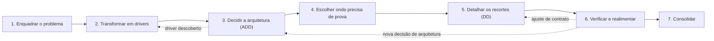

# Modelo: como definir o design do problema em sete passos

> Modelo para preencher. Cada passo explica **o que fazer**, **por quê** e **como saber que terminou**. Os campos entre `[colchetes]` devem ser preenchidos pela equipe; nenhuma resposta sobre o problema está dada aqui.

## Como usar este modelo

- Preencha os passos em ordem, mas espere voltar a passos anteriores: o processo é iterativo.
- Cada passo tem um **critério de conclusão**. Só avance quando ele for atendido ou quando a pendência estiver registrada.
- Toda decisão relevante deve virar um ADR com estado "proposto" até ser aceita pela equipe.
- Quando um campo não puder ser preenchido, registre-o como pendência em vez de deixá-lo vazio.

---

## Passo 1 — Enquadrar o problema

**O que é.** Delimitar o sistema de interesse antes de pensar em solução: o que está dentro da fronteira, o que está fora e quem se importa com ele.

**Por que importa.** Sem fronteira clara, a equipe projeta coisas que não fazem parte do problema ou esquece partes que fazem.

**Perguntas-guia.**

- Qual é o problema central, em uma frase?
- Quais jornadas ou fluxos de negócio o sistema precisa suportar?
- Quais elementos são pessoas, sistemas clientes, sistemas externos, documentos ou componentes do próprio sistema?
- O que está explicitamente fora do escopo?
- Quais termos precisam de definição comum?

**Preencher.**

| Item | Conteúdo |
| --- | --- |
| Problema central | `[...]` |
| Jornadas / fluxos principais | `[...]` |
| Exclusões de escopo | `[...]` |
| Premissas | `[...]` |

| Stakeholder | Preocupações principais |
| --- | --- |
| `[...]` | `[...]` |

| Elemento | Categoria (pessoa, cliente, externo, documento, componente) | Dentro ou fora da fronteira |
| --- | --- | --- |
| `[...]` | `[...]` | `[...]` |

**Saídas esperadas.** Diagrama de contexto, mapa de stakeholders, escopo com exclusões, glossário.

**Critério de conclusão.** Qualquer integrante consegue dizer o que está dentro e fora da fronteira do sistema.

---

## Passo 2 — Transformar o problema em drivers

**O que é.** Converter o problema nas entradas que vão orientar as decisões de arquitetura. No ADD, essas entradas se chamam **drivers**.

**Por que importa.** Decisões de arquitetura só podem ser justificadas contra algo. Os drivers são esse "algo".

**Os cinco tipos de driver.**

| Driver | O que registrar | Preencher |
| --- | --- | --- |
| Propósito do design | Para que serve este design (sistema novo, evolução, prova de conceito, proposta para avaliação) | `[...]` |
| Funcionalidade primária | Casos de uso que mais influenciam a estrutura | `[...]` |
| Cenários de qualidade | Atributos de qualidade em forma mensurável (ver abaixo) | ver tabela |
| Restrições | Decisões já tomadas e não negociáveis (tecnologia, padrões, normas, prazos) | `[...]` |
| Preocupações arquiteturais | Temas que todo sistema precisa tratar mesmo sem pedido explícito (logs, erros, versionamento) | `[...]` |

**Formato do cenário de qualidade (seis partes).**

| Parte | Significado |
| --- | --- |
| Fonte | Quem ou o que gera o estímulo |
| Estímulo | O evento ou a condição que chega ao sistema |
| Artefato | A parte do sistema afetada |
| Ambiente | Em que condição o sistema está (normal, sobrecarga, falha parcial) |
| Resposta | O que o sistema deve fazer |
| Medida | Como verificar objetivamente que a resposta foi atingida |

**Preencher.**

| ID | Atributo | Fonte | Estímulo | Artefato | Ambiente | Resposta | Medida | Importância (A/M/B) | Dificuldade (A/M/B) |
| --- | --- | --- | --- | --- | --- | --- | --- | --- | --- |
| CQ-01 | `[...]` | `[...]` | `[...]` | `[...]` | `[...]` | `[...]` | `[...]` | `[...]` | `[...]` |

**Como priorizar.** Cenários com importância **alta** e dificuldade **alta** entram nas primeiras iterações. Importância baixa com dificuldade baixa pode ficar para o fim ou sair do escopo.

**Quadro de design.** Liste todos os drivers e acompanhe seu estado ao longo das iterações.

| Driver | Não tratado | Parcialmente tratado | Tratado | Observação |
| --- | --- | --- | --- | --- |
| `[...]` | `[ ]` | `[ ]` | `[ ]` | `[...]` |

**Critério de conclusão.** Cada risco conhecido do problema está coberto por ao menos um cenário mensurável e priorizado.

---

## Passo 3 — Decidir a arquitetura em iterações ADD

**O que é.** Tomar as decisões de alto nível que atendem aos drivers prioritários, em ciclos curtos.

**Por que importa.** Decidir tudo de uma vez esconde trocas entre atributos. Iterar torna cada decisão visível e justificável.

**Ciclo de cada iteração.**

| Passo ADD | O que fazer |
| --- | --- |
| 1. Revisar entradas | Confirmar que os drivers estão atualizados |
| 2. Definir o objetivo | Escolher poucos drivers para esta iteração |
| 3. Escolher elementos | Decidir qual parte do sistema refinar (o sistema todo na primeira iteração) |
| 4. Escolher conceitos de design | Comparar **ao menos duas** alternativas (padrões, táticas, arquiteturas de referência, componentes prontos) com critérios |
| 5. Instanciar | Criar elementos concretos, atribuir responsabilidades, esboçar interfaces |
| 6. Registrar | Atualizar visões (C4, sequência) e escrever ADRs |
| 7. Analisar | Mover os cartões no quadro de design e decidir a próxima iteração |

**Preencher por iteração.**

| Campo | Conteúdo |
| --- | --- |
| Iteração nº | `[...]` |
| Objetivo | `[...]` |
| Drivers atacados | `[IDs]` |
| Elementos refinados | `[...]` |
| Alternativas comparadas | `[A]` vs. `[B]` |
| Critérios de comparação | `[...]` |
| Decisão | `[...]` (ADR `[nº]`) |
| Visões atualizadas | `[...]` |
| Estado dos drivers após a iteração | `[...]` |

**Modelo mínimo de ADR.**

| Seção | Conteúdo |
| --- | --- |
| Título | `[...]` |
| Estado | proposto / aceito / substituído |
| Contexto | Qual driver motivou a decisão |
| Alternativas | Pelo menos duas, com prós e contras |
| Decisão | O que foi escolhido |
| Consequências | Ganhos, custos e riscos aceitos |

**Critério de conclusão.** Todo driver prioritário está "tratado" ou "parcialmente tratado" com motivo registrado.

---

## Passo 4 — Escolher onde o raciocínio não basta

**O que é.** Identificar as decisões que só um experimento consegue confirmar e transformá-las em protótipos.

**Por que importa.** Protótipos custam caro. Cada um deve responder a uma pergunta de design, não existir apenas para gerar código.

**Pergunta-guia para cada driver em aberto.** *Uma análise resolve esta dúvida, ou só um experimento?*

**Preencher.**

| Hipótese | Driver relacionado | Recorte a prototipar | Simuladores necessários | Critério de aceitação | Limites | Responsável |
| --- | --- | --- | --- | --- | --- | --- |
| `[...]` | `[ID]` | `[...]` | `[...]` | `[...]` | `[...]` | `[...]` |

**Como escrever uma boa hipótese.** Ela precisa poder ser confirmada **ou refutada** por um resultado observável. "O componente funciona" não é hipótese; "sob condição X, o componente produz Y medido por Z" é.

**Critério de conclusão.** Cada protótipo selecionado está ligado a uma hipótese e a um driver.

---

## Passo 5 — Detalhar apenas os recortes selecionados

**O que é.** Refinar os elementos que serão prototipados até ficarem prontos para implementar e testar (design detalhado).

**Por que importa.** Detalhar tudo desperdiça esforço; detalhar pouco gera decisões improvisadas durante a implementação.

**Pré-condição.** O elemento precisa ter um ADR de alto nível. Sem ele, volte ao passo 3.

**Atividades e o que registrar.**

| Atividade | O que registrar | Preencher |
| --- | --- | --- |
| Interfaces oferecidas | Operações, formatos, erros, versionamento, pré-condições | `[...]` |
| Interfaces consumidas | Dependências e contratos externos | `[...]` |
| Decomposição interna | Componentes internos e responsabilidades | `[...]` |
| Comportamento | Sequências dos fluxos principais e de falha; máquinas de estado | `[...]` |
| Dados | O que persiste, por quanto tempo, chaves, o que nunca vai para logs | `[...]` |
| Táticas locais | Padrões aplicados dentro do elemento | `[...]` |

**Checklist de questões-chave (SWEBOK).**

| Questão | Como o elemento trata | Pendência |
| --- | --- | --- |
| Concorrência | `[...]` | `[...]` |
| Controle e tratamento de eventos | `[...]` | `[...]` |
| Persistência de dados | `[...]` | `[...]` |
| Distribuição de componentes | `[...]` | `[...]` |
| Erros e exceções | `[...]` | `[...]` |
| Segurança | `[...]` | `[...]` |
| Interação com usuário ou sistema | `[...]` | `[...]` |

**Princípios a conferir.** Abstração, coesão, acoplamento, decomposição, encapsulamento, separação entre interface e implementação.

**Critério de conclusão.** É possível implementar o protótipo e escrever seus testes sem tomar novas decisões de arquitetura.

---

## Passo 6 — Verificar e realimentar

**O que é.** Gerar evidência sobre as decisões e corrigir o design a partir dela.

**Por que importa.** Uma decisão sem evidência continua sendo hipótese. Registrar o que não foi verificado é tão importante quanto registrar o que foi.

**Atividades.**

- Executar testes de contrato e experimentos de atributos de qualidade.
- Injetar falhas e incidentes pertinentes a cada recorte.
- Fazer revisão cruzada entre frentes.
- Para cada achado: diagnóstico → alternativas → decisão conjunta → alteração mínima → nova evidência.

**Preencher — resultado das hipóteses.**

| Hipótese | Resultado (confirmada / refutada / inconclusiva) | Evidência | Ação decorrente |
| --- | --- | --- | --- |
| `[...]` | `[...]` | `[...]` | `[...]` |

**Preencher — matriz de rastreabilidade.**

| Requisito / cenário | Elemento de design | Verificação prevista | Evidência | Estado (projetado / implementado / verificado / pendente) |
| --- | --- | --- | --- | --- |
| `[...]` | `[...]` | `[...]` | `[...]` | `[...]` |

**Para onde voltar.**

| Tipo de achado | Retornar ao |
| --- | --- |
| Driver novo ou mal definido | Passo 2 |
| Decisão de arquitetura errada ou incompleta | Passo 3 |
| Ajuste de contrato ou comportamento | Passo 5 |

**Critério de conclusão.** Cada hipótese do passo 4 tem resultado registrado.

---

## Passo 7 — Consolidar a proposta

**O que é.** Integrar tudo em uma proposta única, revisada e coerente.

**Por que importa.** Artefatos dispersos não comunicam o design. A consolidação mostra como as decisões se encaixam e o que ficou em aberto.

**Atividades.**

- Reunir contexto, visões, ADRs, contratos, evidências e limitações.
- Conferir os critérios de aceitação definidos pela equipe.
- Aplicar o checklist de resultados do PCP (MPS.BR).
- Registrar revisão conjunta, retrospectiva e próximos marcos.

**Checklist PCP.**

| Resultado esperado | Evidência | Atendido? |
| --- | --- | --- |
| Alternativas identificadas e avaliadas por critérios | `[...]` | `[ ]` |
| Solução selecionada com justificativa | `[...]` | `[ ]` |
| Design desenvolvido e documentado | `[...]` | `[ ]` |
| Interfaces projetadas e documentadas | `[...]` | `[ ]` |
| Decisão de reutilizar ou adquirir registrada | `[...]` | `[ ]` |
| Produto construído conforme o design | `[...]` | `[ ]` |

**Retrospectiva.**

| Pergunta | Resposta |
| --- | --- |
| Quais decisões mudaram e por quê? | `[...]` |
| Quais drivers ficaram como risco residual? | `[...]` |
| O que não foi verificado? | `[...]` |
| Quais são os próximos marcos? | `[...]` |

---

## Como saber que o design está definido

O design está definido quando as três condições são verdadeiras:

- [ ] Todo driver prioritário está "tratado" ou explicitamente aceito como risco residual.
- [ ] Toda decisão significativa tem ADR ligando-a a um driver e a ao menos uma alternativa rejeitada.
- [ ] Toda afirmação sobre um recorte prototipado tem evidência reproduzível, e o que não foi verificado aparece como tal.

## Atividades de apoio durante todo o processo

| Atividade | O que fazer |
| --- | --- |
| Gestão de configuração | Fixar versões e hashes dos artefatos externos usados nas decisões |
| Registro de decisões | Manter os ADRs atualizados e com estado explícito |
| Gestão de riscos | Atualizar a lista de riscos a cada achado |
| Gestão da informação | Manter uma fonte de verdade única para a equipe |

## Origem metodológica do modelo

Os sete passos são uma síntese adaptada, não a sequência oficial de uma norma. Cada passo vem principalmente de:

| Passo | Fonte principal |
| --- | --- |
| 1. Enquadrar o problema | ISO/IEC/IEEE 12207 — definição de necessidades dos stakeholders |
| 2. Transformar em drivers | ADD — entradas do método |
| 3. Decidir a arquitetura | ADD — iterações; SWEBOK — High-Level Design |
| 4. Escolher onde precisa de prova | ADD — análise; ISO 12207 — gestão de riscos |
| 5. Detalhar os recortes | SWEBOK — Detailed Design; ISO 12207 — definição de design |
| 6. Verificar e realimentar | ISO 12207 — verificação e validação; ADD — análise |
| 7. Consolidar | ISO 12207 — gestão da informação; MPS.BR — PCP |

## Referências

- Cervantes, H.; Kazman, R. *Designing Software Architectures: A Practical Approach*. Addison-Wesley, 2016.
- Bass, L.; Clements, P.; Kazman, R. *Software Architecture in Practice*. 4ª ed. Addison-Wesley, 2021.
- IEEE Computer Society. *SWEBOK — Guide to the Software Engineering Body of Knowledge*.
- ISO/IEC/IEEE 12207:2017. *Systems and software engineering — Software life cycle processes*.
- SOFTEX. *MPS.BR — Guia Geral MPS de Software* (MR-MPS-SW).
