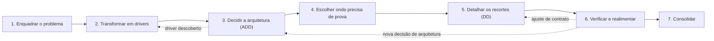

# Como definir o design do problema: sete passos

> Processo para definir o design da Plataforma Estadual de Interoperabilidade em Saúde descrita em `proposta-arquitetura.md`. Proposta para discussão com a equipe; não substitui decisões registradas conforme a seção 27.1.

## 1. O que significa "definir o design"

Definir o design é produzir um **conjunto de decisões justificadas**, de arquitetura e de detalhe, que atendem aos drivers do problema, com **evidência** de que funcionam nos recortes verificados.

O caminho tem três movimentos:

1. **Entender e delimitar o problema** (passos 1 e 2).
2. **Decidir a arquitetura** com o ADD (passos 3 e 4).
3. **Detalhar e verificar só o que precisa de prova** (passos 5 a 7).

O processo não é linear: os retornos do diagrama são esperados e fazem parte do método.

## 2. Os sete passos

### Passo 1 — Enquadrar o problema antes de pensar em solução

**Objetivo.** Definir o que é e o que não é o sistema de interesse.

**Entradas.** Seções 1 a 4, 9, 10 e 25 do documento do projeto.

**Atividades.**

- Descrever as três jornadas clínicas em linguagem de negócio.
- Separar pessoas, sistemas clientes, sistemas externos, documentos e componentes (seção 4).
- Listar stakeholders e suas preocupações (seção 9).
- Registrar exclusões de escopo e premissas (dados sintéticos, sistemas simulados).
- Consolidar o glossário comum.

**Saídas.** Diagrama de contexto C4, mapa de stakeholders, escopo com exclusões, glossário.

**Critério de conclusão.** Qualquer integrante da equipe consegue dizer o que está dentro e fora da fronteira do sistema.

**Aplicação no projeto.** Já bem encaminhado: o objeto são os serviços de interoperabilidade, não os prontuários (seção 2).

---

### Passo 2 — Transformar o problema em drivers

**Objetivo.** Converter o problema em entradas que orientam decisões.

**Entradas.** Saídas do passo 1, restrições (seção 27.1) e riscos (seção 26).

**Atividades.**

- Registrar os cinco tipos de driver do ADD:

| Driver | Conteúdo no projeto |
| --- | --- |
| Propósito do design | Proposta *greenfield* em domínio regulado, para avaliação e prototipagem seletiva |
| Funcionalidade primária | As três jornadas: RAC → IPS e federação, SISCAN, ciclo do medicamento |
| Cenários de qualidade | Interoperabilidade, privacidade, segurança clínica, disponibilidade, modificabilidade, auditabilidade |
| Restrições | Java, Spring Boot, HAPI FHIR, FHIR R4 `4.0.1`, IPS Brasil `1.0.0`, dados sintéticos |
| Preocupações arquiteturais | Logs sem dado clínico, idempotência, versionamento, erros via `OperationOutcome` |

- Escrever os cenários de qualidade no formato de seis partes:

| Parte | Exemplo |
| --- | --- |
| Fonte | Sistema cliente da unidade de saúde |
| Estímulo | Repete a criação de uma requisição após tempo limite |
| Artefato | Adaptador FHIR-SISCAN |
| Ambiente | Operação normal |
| Resposta | Reconhece a repetição pela chave de idempotência |
| Medida | Exatamente um protocolo no SISCAN simulado em 100% dos casos testados |

- Priorizar cada cenário por **importância** e **dificuldade** (alta, média, baixa). Pares (Alta, Alta) entram primeiro.
- Montar o **quadro de design** com todos os drivers na coluna "não tratado".

**Saídas.** Lista priorizada de drivers, cenários de qualidade, quadro de design.

**Critério de conclusão.** Cada risco relevante da seção 26 está coberto por ao menos um cenário mensurável.

**Aplicação no projeto.** É a principal lacuna atual: o documento tem critérios de aceitação, mas os cenários ainda não estão no formato de seis partes.

---

### Passo 3 — Decidir a arquitetura em iterações ADD

**Objetivo.** Tomar as decisões de alto nível que atendem aos drivers prioritários.

**Entradas.** Drivers priorizados e quadro de design.

**Atividades (repetidas a cada iteração).**

1. Revisar as entradas.
2. Definir o objetivo da iteração, escolhendo poucos drivers.
3. Escolher os elementos a refinar.
4. Escolher conceitos de design, comparando ao menos duas alternativas com critérios.
5. Instanciar elementos, atribuir responsabilidades e definir interfaces.
6. Esboçar visões (C4, sequência) e registrar ADRs.
7. Analisar o resultado e mover os cartões no quadro de design.

**Plano de iterações sugerido.**

| Iteração | Objetivo | Alternativas a comparar |
| --- | --- | --- |
| 1 | Estrutura geral | Servidor FHIR compartilhado vs. por serviço; gateway único vs. separado para pares; síncrono vs. eventos |
| 2 | Integração SISCAN | Consulta periódica vs. retorno assíncrono; estado técnico e clínico separados vs. unificados |
| 3 | Medicamentos | Quarentena vs. rejeição de referências pendentes; correlação síncrona vs. assíncrona |
| 4 | IPS e federação | Sessão incremental vs. operação única; IPS materializado vs. visão dinâmica |
| 5 | Transversais | Coletores de auditoria e telemetria separados vs. unificados; políticas de minimização |

**Saídas.** Visão de contêineres C4 justificada, ADRs, quadro de design atualizado.

**Critério de conclusão.** Todo driver prioritário está "tratado" ou "parcialmente tratado" com motivo registrado.

---

### Passo 4 — Escolher onde o raciocínio não basta

**Objetivo.** Selecionar os recortes que precisam de evidência executável.

**Entradas.** Drivers "parcialmente tratados" no quadro, riscos e incrementos da seção 13.

**Atividades.**

- Para cada driver em aberto, perguntar: *uma análise resolve, ou só um experimento?*
- Transformar as dúvidas que exigem experimento em **hipóteses** verificáveis.
- Para cada hipótese, definir recorte, simuladores necessários, critérios da seção 24, limites e responsáveis.

**Exemplos de hipóteses.**

- Consulta periódica e retorno assíncrono duplicado convergem para o mesmo estado no SISCAN.
- O IPS materializado tem melhor auditabilidade que a visão dinâmica sem custo de latência inaceitável.
- Uma dispensação fora de ordem nunca fica disponível para uso clínico antes da resolução.

**Saídas.** Lista de protótipos selecionados com hipótese, critério e limites.

**Critério de conclusão.** Cada protótipo responde a uma pergunta de design; nenhum existe apenas para "ter código".

---

### Passo 5 — Detalhar apenas os recortes selecionados

**Objetivo.** Refinar os contêineres prototipados até ficarem prontos para implementar e testar.

**Entradas.** ADR de alto nível do contêiner e cenários que ele atende. Sem ADR, a decisão ainda é do passo 3.

**Atividades.**

1. **Interfaces:** o que o componente oferece e o que consome; operações, formatos, erros, versionamento, pré-condições.
2. **Decomposição interna:** componentes (C4 nível 3) com alta coesão e baixo acoplamento; portas e adaptadores com Spring.
3. **Comportamento:** diagramas de sequência dos fluxos principais e de falha; máquinas de estado das entidades com ciclo de vida.
4. **Dados:** o que persiste, por quanto tempo, chaves de idempotência e versão, o que nunca vai para logs.
5. **Checklist SWEBOK:** concorrência, eventos, persistência, distribuição, erros e exceções, segurança, interação.
6. **Táticas locais:** *outbox*, receptor idempotente, retentativa com *backoff*, fila de não entregues, controle otimista.
7. **Revisão antes de codar:** revisão cruzada e derivação dos testes de contrato.

**Saídas.** Documento de design detalhado por contêiner, contratos versionados, exemplos válidos e inválidos, casos de teste.

**Critério de conclusão.** É possível implementar o protótipo e escrever seus testes sem decisões novas de arquitetura.

**Aplicação no projeto.** Montador IPS (seção 14) já está nesse nível; o Serviço de Eventos e Subscriptions (seção 17.1) ainda não.

---

### Passo 6 — Verificar e realimentar

**Objetivo.** Gerar evidência e corrigir o design a partir dela.

**Entradas.** Protótipos, contratos e incidentes da seção 21.

**Atividades.**

- Executar testes de contrato e experimentos de atributos de qualidade.
- Injetar os incidentes pertinentes a cada recorte.
- Fazer revisão cruzada entre frentes.
- Para cada achado: diagnóstico, alternativas, decisão conjunta, alteração mínima, nova evidência.
- Atualizar a matriz de rastreabilidade (requisito → elemento → verificação → evidência → estado).

**Saídas.** Relatórios de experimento, ADRs revisados, matriz atualizada, riscos residuais.

**Critério de conclusão.** Cada hipótese do passo 4 tem resultado registrado, seja confirmada, refutada ou inconclusiva.

**Retornos esperados.** Achado de arquitetura volta ao passo 3; ajuste de contrato volta ao passo 5; driver novo volta ao passo 2.

---

### Passo 7 — Consolidar a proposta

**Objetivo.** Integrar tudo em uma proposta de arquitetura única e revisada.

**Atividades.**

- Reunir contexto, contêineres, ADRs, contratos, evidências e limitações.
- Conferir os critérios de aceitação da seção 24.5.
- Aplicar o checklist de resultados do PCP:

| Resultado esperado | Evidência |
| --- | --- |
| Alternativas identificadas e avaliadas por critérios | ADRs com duas ou mais opções |
| Solução selecionada com justificativa | Decisão de cada ADR |
| Design documentado | C4, sequência, estados, modelo de domínio |
| Interfaces projetadas | Contratos versionados |
| Decisão de reutilizar ou adquirir | ADR do HAPI FHIR e dos simuladores |
| Produto conforme o design | Protótipos e testes de contrato |

- Registrar revisão conjunta, retrospectiva e próximos marcos.

**Saídas.** Proposta de arquitetura de alto nível revisada.

**Critério de conclusão.** Ver seção 3.

## 3. Como saber que o design está definido

O design está definido quando três condições são verdadeiras ao mesmo tempo:

1. Todo driver prioritário está "tratado" no quadro de design ou explicitamente aceito como risco residual.
2. Toda decisão significativa tem ADR ligando-a a um driver e a pelo menos uma alternativa rejeitada.
3. Toda afirmação sobre um recorte prototipado tem evidência reproduzível, e o que não foi verificado aparece como tal.

## 4. Atividades de apoio durante todo o processo

| Atividade | Por quê |
| --- | --- |
| Gestão de configuração das linhas de base (versão e SHA-256) | Perfis e contratos externos mudam; decisões dependem da versão |
| Registro de decisões em ADR | Decisões conjuntas precisam de memória e justificativa |
| Atualização da tabela de riscos | Protótipos revelam riscos novos |
| Gestão da informação (`AGENTS.md`, índices) | Oito pessoas precisam da mesma fonte de verdade |

## 5. Papéis e governança

Pela seção 27.1, as decisões são conjuntas, sob coordenação do responsável pelo repositório. Em cada passo, quem conduz uma frente **prepara** alternativas, critérios e recomendação; a equipe **decide**. Os ADRs nascem com estado "proposto" e passam a "aceito" após a deliberação.

## 6. Abordagem usada para definir estes passos

Os sete passos não são uma sequência oficial de nenhuma norma. São uma **síntese adaptada** ao problema, construída em três etapas.

**1. Partir das características do problema.** O documento define a entrega como proposta de arquitetura de alto nível com protótipos seletivos, num domínio regulado com padrões externos versionados, três jornadas com riscos distintos e uma equipe de oito pessoas com decisão conjunta. Isso pede um processo guiado por atributos de qualidade, com detalhamento seletivo e forte gestão de decisões e configuração.

**2. Combinar os quatro modelos em camadas**, cada um onde é mais forte:

| Passo | Modelo principal | Contribuição |
| --- | --- | --- |
| 1. Enquadrar o problema | ISO 12207 (necessidades dos stakeholders) | Delimitação, stakeholders, escopo |
| 2. Transformar em drivers | ADD (entradas) | Cinco tipos de driver, cenários de seis partes, priorização |
| 3. Decidir a arquitetura | ADD (iterações) e SWEBOK High-Level Design | Ciclo de sete passos, alternativas, ADRs |
| 4. Escolher onde precisa de prova | ADD (análise) e ISO 12207 (gestão de riscos) | Hipóteses e seleção de protótipos |
| 5. Detalhar os recortes | SWEBOK Detailed Design e ISO 12207 (definição de design) | Interfaces, estados, dados, questões-chave |
| 6. Verificar e realimentar | ISO 12207 (verificação e validação) e ADD (análise) | Evidência, rastreabilidade, retorno às decisões |
| 7. Consolidar | ISO 12207 (gestão da informação) e PCP (MPS.BR) | Integração e checklist de resultados |

**3. Ancorar nos elementos comuns a todo processo de design.** Não existe processo universal, mas todo bom processo contém: compreender o problema, identificar drivers, gerar alternativas, avaliá-las por critérios, decidir e registrar, detalhar o suficiente e verificar com realimentação. Os sete passos são uma instância desses elementos, na ordem e na profundidade que este problema exige.

A regra que une as camadas: **o ADD comanda a ordem das decisões**; SWEBOK, ISO 12207 e PCP acrescentam critérios de completude, processos de apoio e evidências, sem criar etapas paralelas.

## 7. Referências

- Cervantes, H.; Kazman, R. *Designing Software Architectures: A Practical Approach*. Addison-Wesley, 2016 (ADD 3.0).
- Bass, L.; Clements, P.; Kazman, R. *Software Architecture in Practice*. 4ª ed. Addison-Wesley, 2021.
- IEEE Computer Society. *SWEBOK — Guide to the Software Engineering Body of Knowledge* (Software Design e Software Architecture).
- ISO/IEC/IEEE 12207:2017. *Systems and software engineering — Software life cycle processes*.
- SOFTEX. *MPS.BR — Guia Geral MPS de Software* (MR-MPS-SW), processo Projeto e Construção do Produto (PCP).
